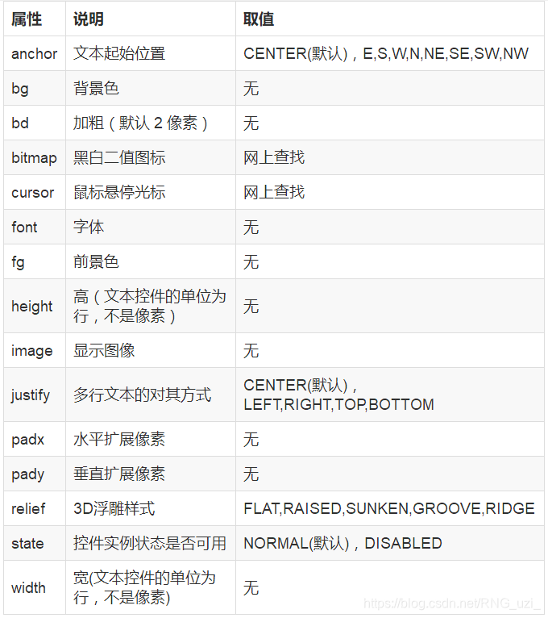

# GUI的相关内容
Python的图形界面开发，主要使用的是Tkinter和PyQT

考虑到我打算实现的功能比较简单，而且Tkinter学起来更方便，所以目前先选择使用Tkinter吧。

## Tkinter的基本思路
在 Tkinter 中所有东西都是组件（Widget），每当你要添加一个组件的时候，思路都是同样的“两步走”：先创建这个组件，然后把这个组件放进窗口。就是这个套路。

```
# 创造一个 Lable 组件，和一个 Button 组件
label = tk.Label(Window,text = "Hello")
butoon = tk.Button(Window,text = "TapMe")

# 把上面两个组件，放到窗口中
label.pack()
butoon.pack()
```

## Tkinter如何进行布局
```
from tkinter import *
root= Tk()
root.title('我的第一个Python窗体')
root.geometry('240x240') # 这里的乘号不是 * ，而是小写英文字母 x
root.mainloop()
```
如上述代码所示，Tkinter最核心的内容就是TK()：
- 调用 Tk()方法可初始化一个根窗体实例 root 
- 用 title() 方法可设置其标题文字
- 用geometry()方法可以设置窗体的大小（以像素为单位）。

将其置于主循环中，除非用户关闭，否则程序始终处于运行状态。执行该程序，一个窗体就呈现出来了。在这个主循环的根窗体中，可持续呈现中的其他可视化控件实例，监测事件的发生并执行相应的处理程序。

## Tkinter的常用组件和组件属性


在窗体上呈现的可视化控件，通常包括**尺寸、颜色、字体、相对位置、浮雕样式、图标样式和悬停光标形状**等共同属性。不同的控件由于形状和功能不同，又有其特征属性。在初始化根窗体和根窗体主循环之间，可实例化窗体控件，并设置其属性。父容器可为根窗体或其他容器控件实例。常见的控件共同属性如下表：


## 控件布局

