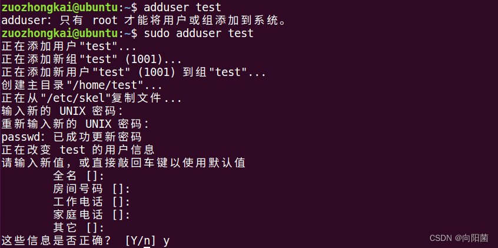

# 了解Shell
首先Shell是一个由C语言编写的程序，用户可以通过该程序来使用Linux。**Shell语言既是一种命令语言，又是一种程序设计语言**。

## Shell 和 Terminal的区别是什么
不妨从游戏的视角出发，在经典的辐射系列，玩家经常要去使用终端(Terminal)来进行某些操作，并且同一个设施里面也有多个终端机，彼此之间所拥有的权限也各不相同，但稍微对计算机史有一点了解的朋友就知道，这些终端彼此之间是共有一个计算机的，终端只是这个计算机的输入输出设备。


而我们使用的Shell则是操作终端的工具，用户在终端编写的命令，首先会被Shell处理，然后转送到计算机，等计算机处理后再由Shell转送回终端。

随着个人计算机的普及，Termianl和Shell的界限也随之淡化，常见的有:

- **Linux：Bash,Shell**
- **Windows:PowerShell,CMD**




# 完全开始前的Shell扫盲
虽然Shell脚本和Shell是不同的，但大家平时念叨的时候会把二者混为一谈，多注意一下就好了。同时编写Shell脚本就像写如Python，php一样，一个文本编辑器+解释器就行。

接下来要关注的是Bash，主要是它最主流，操作界面也最经典。

## Shell 脚本扫盲
- 方便的快捷键：
	- Ctrl+Alt+T： 打开终端
	- Ctrl+D： 关闭终端
    - 使用'#'开头的行就是注释
- 一般的Linux脚本文件都会为其添加后缀.sh, 如： test.sh，但其实不加后缀也能用
- **shebang**: 脚本文件不只可以写bash的，还可以写python的。但Linux如何知道该对哪个脚本文件使用哪个解释器呢？答案就在于脚本文件的第一行: #!/bin/bash  这一行被成为shebang行，里面标明了对于该脚本文件使用的解释器位置。
为什么叫shebang呢？ 原因是'#!'的英语分别是sharp和bang。念快了就是shebang.

## 脚本的整个生命周期：
	- 新建脚本
	- 编写脚本内容
	- 为脚本赋予可执行权限： chmod +x myscript.sh
	- 执行脚本 ./myscript.sh
	(为什么不直接输入myscript.sh呢？答案是如果是./开头就明确
	让OS在当前目录查找并执行该脚本。如果是后者，则OS会去Path
	环境变量中查找。)

### 假如懒得每次都cd进入文件夹执行脚本呢？

那就需要把这个脚本配置到系统变量中去了，步骤如下：
- cd ~/.bashrc, 更改bash的配置文件
- 在最后行声明该脚本文件的地址
- 使用：source ~/.bashrc 激活设置
- 接下来在任何位置，都可以在bash中执行了

# 正式开始的Shell学习
## 基础操作
1.在bash里面为变量赋值的语法是:"foo=bash",调用变量要"$foo"。(一般在引用变量时，都要注意配上双引号，这是为了**防止变量名里面含有特殊字符和空格**)

要注意的是，**禁止使用等号隔开变量，如果使用空格来隔开，如
```
foo = bash
```
则会产生歧义。解释器会认为是要执行一个叫foo的程序，并把'='和'bash'作为参数传回给程序foo

除了上述操作调用变量以外，为防止表述不清，还可以选择在外面再添加一层花括号，如：{$变量}.
```
for skill in Ada Coffe Action Java; do
    echo "I am good at ${skill}Script"
done
```
如果不给skill变量加花括号，写成
```
echo "I am good at $skillScript"
```
解释器就会把$skillScript合起来，当成一个变量（其值为空），代码执行结果就不是我们期望的样子了。

## 不熟悉命令怎么办？
首先要明确一点，但遇到不熟悉的命令时，可以有两种举措：
**ls --help** or **man ls**

区别是这样的： 
- ls --help打开了ls命令内置的说明文档，较为简洁
- man ls 是打开了ls命令在man手册里面的详细说明

(不过我并没有看手册的习惯，手册写的太详细了，又全是英文，让人头晕)
### 怎么看手册
man 手册写的那么详细，再无聊的程序员也不可能完全记住那些参数。于是有了
使用技巧：

(1)在打开man手册的情况下，输入：/ 就可以查找关键字，如：/hidden
(2)不想看man手册，直接使用 tldr<命令>，可以直接获取命令的简化说明，带有示例

## 通配符和花括号（这一节还挺重要的，过一段时间要重写）
- 当想用通配符进行匹配时，可以分别使用？和\*来来匹配任何一个或任意个字符。
- 花括号{}-当有一系列的指令，其中包括一段公共字串时，可以使用花括号
来自动展开这些命令。

## 变量的其他设置
- 使用readyonly命令，可以将变量定义为只读变量，如: 
```
color=white
readonly color
```
- 使用unset命令，可以删除变量，变量被删除后就不能再次使用了，**unset命令无法删除只读变量**如:
```
unset color
```
- Bash中的字符串通过单引号和双引号来定义，但两者也有区别：
    - 使用单引号定义的字符串为原意字符串，里面包含的变量不会被转义,也就是说单引号里面有什么，就输出什么，不会改变。
    - 使用双引号定义的字符串会将其中的变量转义,如果里面有变量，就会把变量转换

- 使用declare或typeset命令可以定义整数变量: declare -i rules=12
- 环境变量：这些由OS或者用户设置的特殊变量，用于配置Shell的行为，并影响其执行环境，PATH变量会包含OS搜索可执行文件的路径: echo $PATH
- Bash支持一维数组(不支持多维数组),并且没有规定数组的大小
  同C语言一样，数组元素的下标由0开始编号，获取数组中的元素要利用下标，下标可以是整数或算术表达式，其值应大于等于0

```
在Shell中，用括号来表达数组，数组元素之间用"空格"符号分割开
数组名=(值1 值2 ... 值n)

array_name=(value0 value1 value2 value3)
```
读取数组(一般格式)
${数组名[下标]}

3.bash作为脚本语言，也支持if,case,while,for这些控制流关键字。同样的，bash也
支持函数，如：
	mcd(){
		mkdir -p "$1"  //这里的$1表示这是脚本的第一个参数
		cd "$1"			//bash有别于其他编程语言的特点，bash有很多特殊变量
	}

## 常见的bash脚本特殊变量
- $0 - 脚本名
- $1 到 $9 - 脚本的参数。 $1 是第一个参数，依此类推。
- $@ - 所有参数
- $# - 参数个数
- $? - 前一个命令的返回值
- $$ - 当前脚本的进程识别码
- !! 完整的上一条命令，包括参数。常见应用：当你因为权限不足执行命令失败时，可以使用 sudo !! 再尝试一次。
$_ - 上一条命令的最后一个参数。如果你正在使用的是交互式 shell，你可以通过按下 Esc 之后键入 . 来获取这个值。

# shell基本运算符
原生的bash并不支持简单的数学运算，但可以通过调用其他命令来实现，如awk和expr。其中expr使用的最多，用法如下:
```
#!/bin/bash
val=`expr 2 + 2`
echo "两数之和为: $val"
```
要注意：
- **表达式和运算符之间必须要用空格隔开**，这一点和之前学的编程语言完全不同
- 完整的表达式要被``包裹，注意**不是单引号**

## 关系运算符(返回值为true或false)
**关系运算符的比较对象，只支持数字，不支持字符串**,常用的关系运算符有:
(1)-eq: 检查两个数是否相等---a==b
(2)-ne: 检查两个数是不是不相等---a!=b
(3)-gt: 检查左边的数是否大于右边---a>b
(4)-lt: 检查左边的数是否小于右边---a<b
(5)-ge: 检查左边的数是否大于等于右边---a>=b
(6)-le: 检查左边的数是否小于等于右边---a<=b

## 字符串运算符
(1)=: 检查两个字符串是否相等---[ $a = $b] 
(2)!=: 检查两个字符串是否不相等---[ $a != $b]
(3)-z: 检查字符串长度是否为0---[ -z $a]
(4)-n: 检查字符串长度是否不为0---[ -n "$a"]
(5)$: 检查字符串是否不为空---[ $a ]

## Shell流程控制
### if else用法：
```
if condition; then 
    代码块
fi
```

```
if condition; then
    command1 
    command2
    ...
    commandN
else
    command
fi
```

```
if condition1
then
    command1
elif condition2 
then 
    command2
else
    commandN
fi
```
### for循环
```
for var in item1 item2 ... itemN
do
    command1
    command2
    ...
    commandN
done
```
### while语句
```
while condition
do
    command
done
```

## 命令的输出
命令通常使用STDOUT来返回输出值，使用STDERR来返回错误及错误码，便于脚本以更加友好的方式来报告错误。返回码或退出状态是脚本/命令之间交流执行状态的方式。返回值0表示脚本正常运行，其他所有非0的返回值都表示有错误发生。

退出码可以搭配&&(与操作)和||(或操作)来使用，同一行的多个命令可以用;隔开。

