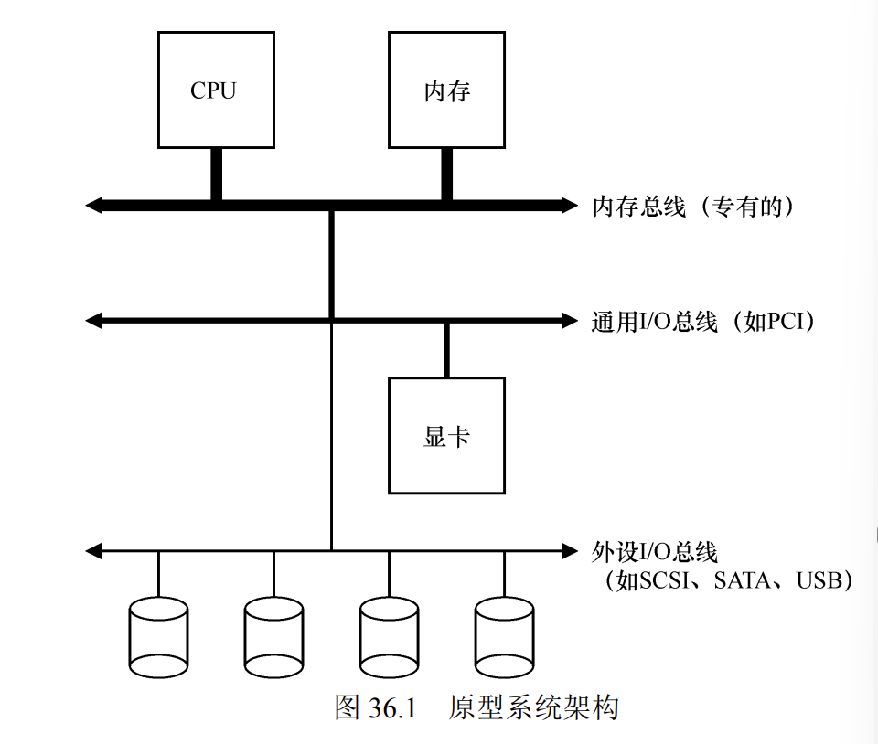

## I/O设备
### 系统架构

如图所示，CPU和内存使用内存总线连着，而显卡这种高性能I/O设备通过通用总线连接到系统，而其他的I/O设备比如鼠标，键盘等都通过外设总线连接到系统。这样设计架构的原因是速度越快的线造价越贵。
### 标准I/O设备

一个标准的设备包括两个部分，一个是该设备暴露给系统的接口，通过接口其他的设备就可以与其进行交互。另一部分就是为了实现接口而做的内部构造，一些简单的放几个芯片就行，复杂的可能也要内置个小CPU.
### 标准协议
仍然以上图为例，接口可以大致的分为三部分：
- 状态寄存器：可以通过该寄存器查看设备目前的状态
- 命令寄存器：通知设备执行某项具体任务
- 数据寄存器：将数据传输给设备，或者接受来自设备的数据

    示例代码：
    while(Status=busy) ; //自旋等待设备就绪
    write data to data-rigister;  //把数据准备好
    write command to command-register; //给命令寄存器写入新命令并执行
    while(Status=busy) ; //等待设备执行此命令之后的结果
    虽然简单，但是自旋总是会浪费系统资源的，自旋的时间可以去执行另一个进程。
### 使用中断减少CPU开销
虽然上面的代码简单，但是自旋总是会浪费系统资源的，CPU自旋的时间可以去执行另一个进程。

因此引入了中断的概念，当进程A在CPU上运行，并在某一个时间结点进行了一次I/O请求后，在I/O请求等到满足之前，CPU就会让进程A休眠，进入等待队列，同时切换运行进程B。在I/O得到满足后，触发中断，操作系统唤醒进程A继续运行。

### 系统和设备交互的方法
- 根据寄存器的定义，系统可以使用"特权指令"，点名某一个特定的设备和它的寄存器，然后把数据存进去
- 内存映射，硬件把设备寄存器作为地址内存提供。当需要访问设备寄存器的时候，操作系统读取或者写入该地址内存，然后硬件把这个地址内存里的东西发给设备，而不是内存。

## 磁盘驱动器(hard-disk-drive)
### 接口

这里的接口指的是磁盘驱动器如何同其他设备相通信，在这里就是通过读取或者写入扇区实现的。

磁盘驱动器由大量的扇区组成，每一个扇区的大小为512字节，所有的扇区都支持写入和读取操作，扇区从(0,n-1)进行编号。
与此同时，为了提升速度，往往能支持同时对多个扇区的写和读取，但驱动制作商只能保持单个512字节的写入是原子的，因此如果在写入的时候断电，就很容易丢失部分数据。

### 磁盘的寻道操作

通过示意图可以知道，磁盘是由一个个磁道组成，磁道又可以区分为若干个扇区，而每个扇区存储的数据量都相同。磁盘的中间放着主轴，主轴通过连接电机带动整个磁盘转动。旋转速率以每分钟转速(RPM来测量)。

由于磁盘的几何是圆形，则内圈必然会比外圈小，因此外圈往往比内圈拥有更多的扇区。我们会把磁盘区分为多个区域，每个区域内部的所有磁道扇区数目都一样。
而显而易见的是，外层区域的扇区数比内层区域的扇区数多。

写入操作的顺序是这样的：
- 1.首先由磁臂带动磁头移动找到对应的磁道
- 2.等待主轴旋转，使该磁道上对应的扇区旋转到磁头下方
- 3.完成写入操作

此外为了提升写入/读取速度，往往磁盘驱动器会拥有缓存，缓存是少量的内存(8MB-16MB),当读取一个扇区之后，驱动器可以将这个磁道上的所有扇区都存到缓存里面，这样后续对同一磁道的所有操作都可以加快了。

### 计算I/O时间
通过了解磁盘读取数据的操作，就可以给出I/O时间的计算公式

TI/O=T寻道+T旋转+T传输

T传输=$\frac{\text{传输大小}}{\text{最大传输速度}}$

一般计算出旋转一周的时间后，往往会除以2取平均值

### 磁盘调度
任务调度的中每个任务的长度事先不知道，但是磁盘调度的时候，可以猜测每一次需要多久，因此可以更灵活一些。
- SSTF(最短寻道时间优先)：顾名思义，选择I/O队列中和现在磁头所指向磁道最近的那一条。
- 电梯(SCAN):磁头从某一个磁道开始，朝磁道最大的端或者磁道最小的端移动，沿路进行寻址。到了最端之后再反方向移动，把剩下的路线寻址了，理解起来蛮轻松的。
- SPTF(最短定位时间优先):磁盘中最昂贵的操作就是寻道和旋转，如果选择的耗费大于寻道，那么我们会选择去离当前磁道更远而旋转耗费少的，而不是离当前磁道近而旋转耗费多的。反之也一样，核心就是总时间越小越好。

## 错题
- 2015/408/21．在采用中断 I/O 方式控制打印输出的情况下，CPU 和打印控制接口中的 I/O 端口之间交换的信
息不可能是 。

A．打印字符 B．主存地址 C．设备状态 D．控制命
解析：了解I/O设备的寄存器有哪些就行了

- 2015/408/32．某硬盘有 200 个磁道（最外侧磁道号为 0），磁道访问请求序列为：130,42,180,15,199，当前磁
头位于第 58 号磁道并从外侧向内侧移动。按照 SCAN 调度方法处理完上述请求后，磁头移过的磁道数
是 。

 A．208 B．287 C．325 D．382
