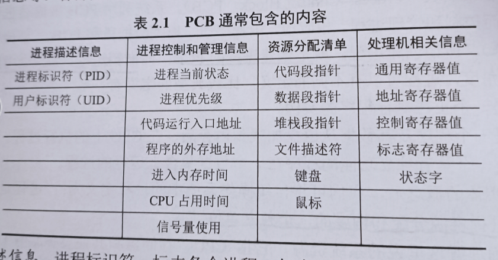
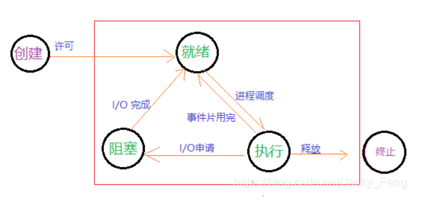
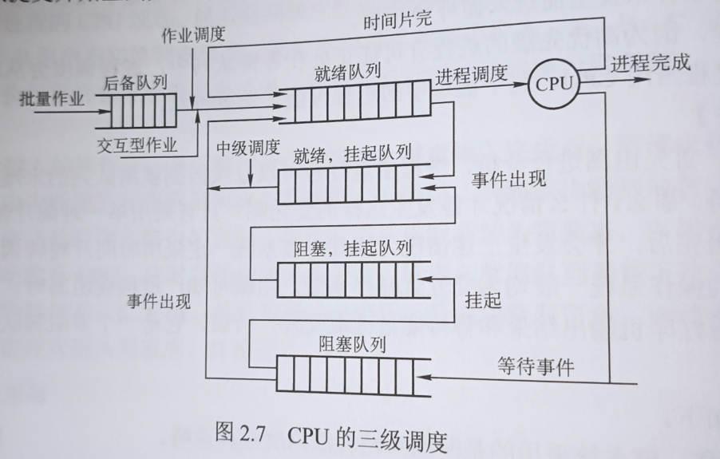
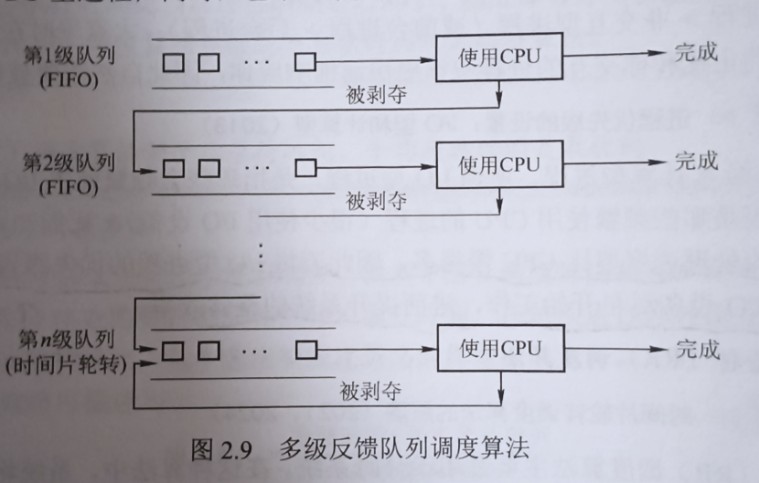
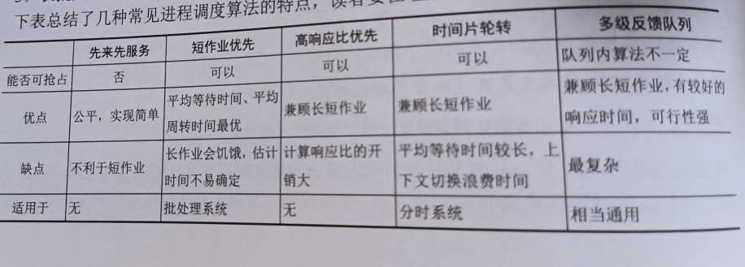

# 进程的概念和特征
现在的系统基本都是同时处理多道程序的，为了允许程序能够独立的并发执行而不互相影响，需要对每一个运行中的程序进行控制，为此引入了进程概念。

每一个进程都配备一个PCB(Process-Control-Block)。一个标准的进程由:程序段，数据段和PCB组成。创建进程也就是创建PCB;同理销毁进程，就是销毁对应的PCB。

综上所述，可以得知
进程就是系统进行资源分配和调度的一个独立单元。

## 进程控制块(PCB)

了解PCB对于了解进程至关重要，在进程创建的时候，OS为其创建一个对应的PCB，并将其长驻在内存里面，直到将其销毁。

内容介绍：
- 进程描述信息：主要就是标识号，每一个进程都有对应的唯一标识符PID。用户标识符显示的是此进程属于哪个用户，方便共享或者保护。
- 进程控制和管理信息：最重要的部分，标志这个进程的工作状态：运行，就绪还是堵塞？等一系列关键信息。
- 资源分配清单：说明有关内存空间和虚拟地址空间的信息啥的。
- 处理机相关信息：也是很重要的，保存进程的上下文，在进程切换的时候要负责保存此时的CPU各寄存器状态，方便回头再次运行时，能从断点继续执行。

## 进程的状态与转换

- 1.运行态：此时进程在CPU上运行，在单处理器上，最多只能有一个进程在运行态。
- 2.就绪态: 此时进程获得了除CPU以外的所有系统资源，一旦获得CPU就会切换到运行态。
- 3.阻塞态：也被称之为等待态，进程在等待所需的其他系统资源(I/O请求啥的)，此时就算CPU是空闲的，阻塞态的进程也不能运行
- 4.创建态：进程创建时要为其创建PCB，分配对应的内存资源什么的，此时由于某种原因，创建工作并未完成，此时称之为创建态。
- 5.终止态：此时的进程准备被销毁了，OS先把它设置为终止态，然后进一步处理释放内存空间等操作。

## 进程的控制
允许一个进程创建另一个进程，子进程可以继承父进程所有的资源；当子进程被撤销的时候，应把其从父进程那里获得的资源归还给父进程。父进程被撤销时，也会同步销毁所有的子进程。

终端用户登录，作业调度，系统提供服务，用户程序的应用请求等都会引起进程的创建

正在运行中的进程由于正在期待某些事件发生，此时并不工作，为了让CPU不闲着，这个进程就会调用阻塞原语，将自己切换到阻塞态。因此，阻塞是进程主动做的

## 进程的通信
- 1.共享存储：在通信的进程之间有一个共享的地址空间，他们通过读/取地址空间内的数据来达到通信的功能；操作系统只负责提供存储空间和同步互斥工具，数据交换由用户自行安排。
- 2.消息传递：通信双方没有共享的地址空间，必须使用OS提供的发送信息和接受信息原语来通信。具体又区分为：
    - 直接通信方式：发送进程直接把消息发给接受进程，并把他挂在接收进程的消息缓冲队列上。接受进程从缓冲队列上取消息。
    - 间接通信方式：发送进程将消息发送到某个中间实体上，接受进程在从中间实体上获取信息。类比邮差把信放到信箱里。
- 3.管道通信:管道通信由于与互斥那一章有联系，所以考的比较多。管道又称pip,本质上是一种共享文件，在linux上一般也就4KB。数据在管道之中是先进先出的。
    - 互斥：在一个进程对管道进行读/写操作的时候，其他进程都必须等待。(这一点存疑，如果从生产者-消费者的思想出发，那么应该可以同时拥有多个进程写/读才对)
    - 同步：当写进程将管道塞满后，应该写进程堵塞；相应的读进程把管道读空后，读进程也应该阻塞。
    - 通信双方应该能确定对方的存在。

## 线程和多线程
引入线程是为了进一步减小程序在并发执行时所付出的时空开销，提高OS的并发性能。

线程一般由线程ID，程序计数器，寄存器集合和堆栈组成。它是被被系统独立调度和分配的基本单元

在引入线程后，进程就只是为线程提供除CPU以外的系统资源，而线程就作为CPU的分配单元。

## 线程的实现方式
- 用户级线程：有关用户线程的所有操作都在用户态完成，内核意识不到线程的存在。对于设置了用户级线程的系统，其调度仍以进程为单位;
    - 优点：(1)进程之间的切换不需要切换用户态和内核态，减少了切换开销;

             (2)不用的进程可以使用自己专属的调度算法。
    - 缺点:(1)因为系统调度以进程为单位，因此某一进程的单独一个线程如果堵塞，将导致同一进程下的所有线程都被堵塞。

            (2)无法发挥出多CPU的优势，无论怎么样，都只能在一个CPU里面调用一个进程里的一个线程，达不到并发的要求。
- 内核级线程：OS为每一个内核级线程设置一个线程控制块(TCB),通过TCB，内核得以感知线程并对其加以控制。
    - 优点:(1)可以发挥出多CPU的优势，内核能同时调度一个进程下的多个线程，达到并发的要求。

            (2)如果进程内的某一个线程被阻塞，CPU可以调度该进程下的其他线程，也可以运行其他进程下的线程
    - 缺点：(1)同一进程下线程的切换，也需要从用户态切换到内核态，系统的开销大。

# 调度

## 调度的概念和层次
在多道程序系统中，进程的数量往往高于CPU个数，因此进程之间就会抢占CPU资源，为了使得竞争变得高效，就提出了调度的概念。

调度的层次：一个进程从外存中调到内存，再从内存调到CPU里面去处理对应了三个层次:

- 高级调度(作业调度):按照某种规则从外存挑选一个(或多个)作业，给其分配内存，I/O设备等资源，并建立进程。
- 中级调度(内存调度):为了提高内存利用率和系统吞吐量，将暂时不需要运行的进程调回外存。当那些进程又具备运行条件且内存空闲时，再把他们调回内存。
- 低级调度(进程调度):根据某种算法，让处于就绪队列的进程获得CPU资源。

## 调度时机，切换
在现代操作系统中，应该进行调度和切换的操作有：
- 创建新进程后，父进程和子进程都处于就绪态，OS需要进行调度，决定谁先运行。

- 进程正常结束后或异常终止时，必须从就绪队列中挑一个进程运行。

- 当进程因为I/O请求，信号量操作等原因被阻塞时，也需要调度另一个进程运行。

- 当I/O设备有空时，发出I/O中断，原先请求I/O的进程从阻塞态变成就绪态。OS需要决定是继续运行当且进程，还是切换到请求I/O的进程。

进程切换往往在调度完成后立刻发生，它要求保存当前断点的现场信息，并恢复被调度进程(即将运行的)的现场信息。

不能进行调度和切换的情况：
- 处理中断时，中断处理是系统工作的一部分，不应该被剥夺CPU资源。
- 执行原子指令时：源自指令只有执行和结束两种状态，一旦原子指令开始执行，就连中断都无法终止它。

进程调度的方式

(1)非抢占型调度：当一个进程正在CPU上运行时，除非它运行结束或者进入堵塞状态，不然任何进程都无法打断它。

(2)抢占型:正在运行中的进程可能会被某个优先级更高的进程中断。

## 调度的目标
五种平平无奇的评判标准:

(1)$$CPU利用率=
\frac{\text{CPU有效工作时间}}{\text{CPU有效工作时间+CPU空闲等待时间}}$$

(2)系统吞吐量：单位时间CPU完成的作业数量;长作业会消耗更多的
时间，从而降低吞吐量；短作业反之。

(3)周转时间:指的是从作业提交到作业完成所经历的时间；具体来说是：作业等待，在就绪队列中排队，在CPU上运行以及I/O操作所花费的时间总和。
$$周转时间=作业完成时间-作业提交时间$$
$$平均周转时间=(周转时间1+周转时间2+...+周转时间n)/n$$

(4)等待时间：进程从进入就绪队列，到进入CPU所等待的时间。CPU调度算法实际上并不能影响作业的执行或者I/O操作时间，所能影响的只有等待时间

(5)响应时间：从用户提交请求到系统第一次产生响应所花的时间。

## 典型的调度算法
- FCFS(first-come-first-serive)：思想很简单，哪个进程先进入就绪队列，哪个进程就先优先被调度。有利于CPU繁忙型作业，而不利于I/O繁忙作业。

- SJF(Short-job-first):从就绪队列中选择一个估计运行时间最短的进程，将CPU分配给它；会产生"饥饿"现象。

- 高相应比优先调度算法：$$响应比=\frac{\text{等待时间+要求服务时间}}{\text{要求服务时间}}$$
随着等待时间的增长，进程的优先级在增加；同时等待时间相同的话，要求服务时间低又会提升优先级；这样就同时有利于短作业，又避免了长作业的饥饿现象。

- 优先级调度算法：每次从后背队列中找到优先级最高的进程进行调度，分为：
    - 非抢占式优先级调度算法：当进程在CPU内运行，即使有另一个优先级更高的进程，也不会中断，而是继续运行。
    - 抢占式优先级调度算法：优先级更高的进程可以直接暂停目前运行的进程。

除此之外又可以区分为静态优先级和动态优先级：
- 静态优先级：优先级在创建进程的时候就创建好，之后都不能更改。
- 动态优先级：创建进程的时候也会被赋予一个优先级，但会随着情况的改变而改变进程的优先级。

I/O型和计算型优先级：
由于I/O设备的处理速度远慢于CPU的速度，因此应该让I/O型进程的优先级高于计算型的进程，这样就可以释放出更多的CPU资源。

- 时间片轮转(RR)调度算法：把所有的就绪进程按照FCFS策略排成一个队列，每一个进程都只占一个时间片，时间片一旦用完，就会从就绪队列中取出队首的进程继续占用下一个时间片。

- 多级队列调度算法：系统设计多个就绪队列，队列与队列之间的优先级不同，队列内部的进程之间的优先级也不同。

- 多级反馈队列调度算法:

(1)有多个优先级不同的就绪队列

(2)每个队列的时间片长度不同，优先级越低时间片长度越长

(3)新进程进入内存后，首先放到第一级队列，在时间片用完后，如果还没有执行完毕，就自动往下降级，插到下一级队列的末尾。以此类推，直到完成。

(4)按队列优先级调度，仅当第一级队列为空时，才能调度第二季的队列

## 机制：受限直接执行
为了给所有的进程营造出它们都有专属于自己的CPU假象，思想就是时分共用，让不同的进程在不同的时间片下单独运行。

核心问题式：
- 进程单独运行的时候，怎么样规范它，不让它做超过自身权限的操作
- 如果实现进程的上下文切换

### 内核模式和陷阱
进程在运行的时候往往执行一些特殊操作，比如从硬盘里面读出数据，或者创建一个新的线程。这些操作都是比较敏感的，出于安全或者提升性能的考虑，我们希望进程在执行这些操作时是受监督的。

于是处理器被分成了两个模式：用户模式和内核模式；在用户模式下运行的代码会被限制，做出类似I/O请求的操作时会引发异常，操作系统会终结该进程。内核模式下，进程就可以执行特权操作。
### 该如何进入内核模式？
操作系统为用户们提供了一堆系统调用，包括：访问文件系统，与其他进程通信，分配更多内存。进程通过使用系统调用来进入内核模式。具体来说是：

    代码示例：
    int main(){
        printf("hello word\n");
        return 0;
    }

在上述代码中，很明显是用printf做了一次I/O操作。进程首先执行printf()函数，而printf()函数实际上内部封装了一个系统调用函数write()。通过系统调用的方式，CPU从用户模式提升到了内核模式，并且输出，并返回发起调用的进程中，同时CPU降低权限，回到用户模式。
### 如何在进程之间切换？
有一种笨方法，直接等，等到进程结束为止，但这样太逆天了。
正常的做法是使用时钟中断来完成，每隔一段时间就中断目前正在进行的进程，再由操作系统获得CPU控制权，然后它就可以切换进程了。

进行上下文切换时，OS要做的就是为当前正在执行的进程保存一些寄存器的值(保存到进程的内核栈中)，并为即将执行的进程回复一些寄存器的值(从内核栈中)，这样OS就可以确保执行陷阱返回指令时，不会返回到之前运行的进程，而是继续执行另一个进程。

## 错题
2015/408/22内部异常（内中断）可分为故障（fault）、陷阱（trap）和终止（abort）三类。下列有关内部异
常的叙述中，错误的是 。

A．内部异常的产生与当前执行指令相关
B．内部异常的检测由 CPU 内部逻辑实现
C．内部异常的响应发生在指令执行过程中
D．内部异常处理后返回到发生异常的指令继续执行

解析：并不一定就是处理完异常就回去，也可能去执行另一个进程。