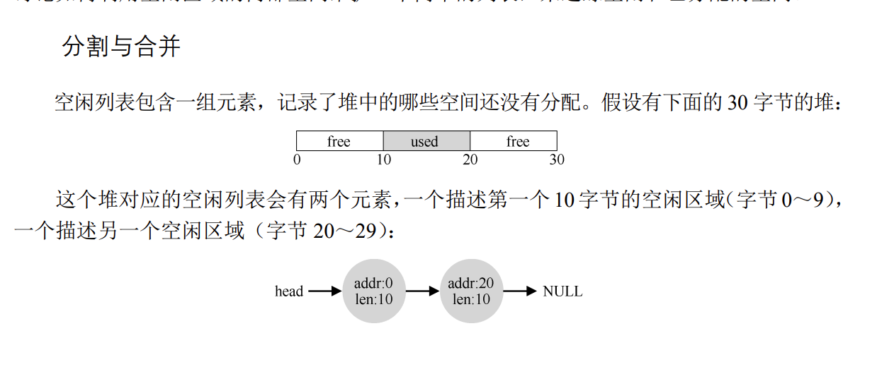

# 虚拟内存的知识

## 抽象：地址空间
**地址空间是抽象的，只是为了方便人们理解，在实际的物理内存里面并不存在**

### 为什么要有地址空间？
之所以我们不采用直接访问物理内存地址，而使用地址空间来间接访问的原因有以下几点：
- 简化编程：不可能让程序员在编程的时候实时记录此时内存空间里面有哪些是空的，哪些是满的。这太麻烦了，直接使用地址空间，让OS帮你进行定位，大幅减轻了编程压力。
- 内存管理:内存是很稀缺的资源，就那么大的存储空间，如果想要让超过内存空间的进程同时运行，我们就需要选择性的把一部分不那么重要的进程放到磁盘里面去。使用地址空间，我们就可以把一部分进程移到磁盘里面去，但是对外仍然保留着其还在内存的假象。

地址空间包含了进程的所有内存状态。上图展示了一个16KB大小的地址空间，在空间的最开始是一个总大小为1KB的程序代码。由于在程序运行时候地址空间中的堆段和栈段有可能会申请新的空间，且栈向上增长（当用户进行程序调用时），堆向下增长(当用户通过malloc()申请新空间时)。**上图仅是一个实例，实际中三个段的位置可以随用户喜好更改**

## 机制：地址转换
地址空间是为了方便程序员理解和编写代码的，但是想要程序正确的运行，就必须要想办法把地址空间和物理内存对应上，这个机制就是地址转换(address-translation)。这个机制提供了所有正在运行的进程一个假象：其拥有一个巨大的，私有的内存空间，然而实际上它是和其他所有进程一起共享内存的。

### 基础示例
    代码示例：
    128: movl 0x0(%ebx), %eax ;load 0+ebx into eax 
    132: addl $0x03, %eax ;add 3 to eax register 
    135: movl %eax, 0x0(%ebx) ;store eax back to mem 

上图说明了该进程的地址空间在物理内存中可能的对应关系。

## 如何将地址空间转换为物理内存的地址呢？
### 动态(基于硬件)重定位：引入基址(base)/界限(bound)寄存器

采用这种方法，程序真正执行时，OS将决定其在物理内存中的实际加载位置，并把**此位置的起始地址存放在base中**，而原来的地址空间的地址也就变成了在物理内存中距离base的偏移量。

    公式：Physical_address = virtual_address + base

### 界限寄存器
界限寄存器提供地址保护，其作用是判断转换后的物理地址有没有超出地址空间。比如界限地址设定为16KB,那么
    
    if(physical_address>base+bound)
    {
        //地址越界，执行异常处理程序
    }

这种基址寄存器配合界限寄存器的硬件结构是芯片中的（每个CPU一对）。有时我们将CPU 负责地址转换的部分统称为内存管理单元（Memory Management Unit，MMU）。
### 更进一步的示例

### 小结
第一：在进程创建时，操作系统必须采取行动，为进程的地址空间找到内存空间。由于我们假设每个进程的地址空间小于物理内存的大小，并且大小相同，这对操作系统来说
很容易。它可以把整个物理内存看作一组槽块，标记了空闲或已用。当新进程创建时，操
作系统检索这个数据结构（常被称为空闲列表，free list），为新地址空间找到位置，并将其标记为已用。

第二：在进程终止时（正常退出，或因行为不端被强制终止），操作系统也必须做一些
工作，回收它的所有内存，给其他进程或者操作系统使用。在进程终止时，操作系统会将
这些内存放回到空闲列表，并根据需要清除相关的数据结构。

第三：在上下文切换时，操作系统也必须执行一些额外的操作。每个 CPU 毕竟只有一
个基址寄存器和一个界限寄存器，但对于每个运行的程序，它们的值都不同。因此，在切换进程时，操作系统必须保存和恢复基址和界限寄存器。具体来说，当操作系统决定中止当前的运行进程时，它必须将当前基址和界限寄存器中的内容保存在**内存**中，放在某种每个进程都有的结构中，如进程结构（process structure）或进程控制（Process Control Block，PCB）中。类似地，当操作系统恢复执行某个进程时（或第一次执行），也必须给基址和界限寄存器设置正确的值。

第四：操作系统必须提供异常处理程序（exception handler），或要一些调用的函数，像上面提到的那样。操作系统在启动时加载这些处理程序（通过特权命令）。例如，当一个进程试图越界访问内存时，CPU 会触发异常。

## 分段
### 为什么要引入分段？
如果只是使用一个基址/界限寄存器，那么根据之前的情况可以看到：
+ 在堆和栈直接还会存在一大块未使用的区域，这就造成了资源的浪费。
+ 同时，假如内存中已经没有连续的空间可以满足进程的需求，则进程就不能正常运行了。

为了解决上述问题，引入了分段的概念：MMU将引入多个基址/界限寄存器对，为地址空间的每一个段（代码段，栈段，堆段）都设一个，这样就可以把不同的段都放置到不同的物理空间去。在这里，就只有已用的内存才会分配物理内存

### 应该使用哪个段？

### 分段后的地址转换

    以代码段为例，设虚拟地址为100
    仍然采用公式：
    Physical_address = virtual_address + base
    Physical_address = 100 + 32KB = 32868

    以堆为例，设虚拟地址是4200
    ！！！这里需要额外考虑的就是不同虚拟地址对应的偏移量，此时堆在虚拟地址中是从4KB开始的，则偏移量（段内）就是4200-4KB=104
    Physical_address = 104 + 34KB = 34920

    以栈为例，设虚拟地址是15KB，其对应的16进制是0x3C00
    对应的二进制是：11 1100 0000 0000
    根据分段原则，前面的二位用来表明此地址空间是栈段，由于栈是反向增长的，故而
    需要额外注意计算其偏移量。
    从二进制的后12位可以知道偏移量是：2^11+2^10=3KB, 而段的最大空间为2^12=4KB,因此偏移量应该为：3KB-4KB=-1KB,
    Physical_address = 28KB - 1KB = 27KB
    **对于栈的地址转换我仍然存疑，猜测是表达偏移量的二进制数没办法表达负数，因此只能拐弯抹角的通过减去4KB来等到一个负数**

### 分段后仍然有的麻烦

通过分段后，我们在物理内存里面存了很多个大小不一的段，随着存的内容越多，麻烦也随着而来，首先的问题就是产生了外部碎片。
(对应外部碎片的是，地址空间里面被分配却没有实际利用的空间，称之为内部碎片)

如左图所示，如果想要分配一个20KB的段，虽然内存里面还有24KB的空闲，但是却不是连续的，因而无法满足分配需求。
一种解决办法是隔一段时间，OS将正在运行的进程关掉，然后统一分配到新的地址空间，让空间再紧凑起来。另一种方案是使用空闲列表对内存空间进行管理。然而再精妙的算法都无法完全消除外部碎片。

## 空闲空间管理
在面临不同长度的内存请求时，我们该如何管理空闲空间？什么样的策略可以使碎片最小化呢？不同方法的时间和空间开销又如何？

### 空闲列表

分割： 试想一下现在有一个进程申请了1个字节的内存空间，为了满足其需求，空闲列表中的一个元素便分割了一个字节来满足其需求。

合并：假设我现在返还了二个元素中间的一块被使用区域，其大小为10字节，则：

然而这样仍然把好好的地址分的七零八落的，系统也没办法为超过10个字节的请求分配空间，于是合并机制出现了。每当一块空间被释放之后，都会检查周围有无同样空闲的空间，有的话就将其合并为一个。

### 头块

    如果观察free()函数就会发现，在释放一个内存空间的时候，free函数只需要知道该内存空间的起始地址就好了，那么它如何知道该释放多大的内存空间呢？这里就是头块的概念了。
    在申请地址的时候，其实就在地址前面加了一段用来表达此地址的内容。

头块用来存放被分配地址的相关信息，也就是说使用malloc()申请空间的大小实际上等于头块的大小+用户申请的空间大小。

### 空闲列表分配策略

- 最优分配：遍历整个列表，从中找到和请求空间最接近的空闲块。缺点是会留下很多小块
- 最差匹配：遍历整个列表，找到最大的空闲块，分割满足需求的块后在存回空闲列表
- 首次匹配：每次从列表的开始查找，在找到第一个足够大的块，分割后给用户。优点是不用遍历整个列表，速度变快，也会导致在空闲列表的开头就存在很多小块。
- 下次匹配：此算法多维护一个指针，指向上一次查找结束的位置。目的是将查找操作扩散到整个列表中，避免了对开头频繁的分割。

## 分页：介绍
区别于分段将整体的内存空间分割成**不同长度**的分片，分页却将整体的内存空间分割成了**固定长度**的分片

以上图为例，地址空间总共64字节，以16字节分页，可分为4页。与此同时，物理内存共128字节，以16字节分页，可分为8页，所需的就是从空闲列表中找到4个空闲页就可以满足需求。

同样的，需要解决地址空间和物理内存地址对应的关系，引入了页表的概念。页表是每一个进程所**独有**的。有多少个进程就有多少个对应的页表，为了方便转变，地址空间被写成如下的形式：VPN---虚拟页号，Offset---偏移量

共有4个页，所有使用2位来表达该地址来自第几页。一个页内有16个字节，故而使用4位来表示业内的偏移量。在实际转换中，使用页表负责将地址空间中的页对应到物理内存的页帧中。以虚拟地址21为例，转换方式如下：

### 页表项(PTE):页表由什么组成

### 分页的问题
- 分页将物理地址分割成了许多的小片，而每一个进程又都独立拥有自己的页表，以一个32位的地址空间为例，4KB作为一页

总页数 = 2^32/4/1024 = 2^20
表明操作系统需要为每一个进程单独管理2^20个地址转换，假设每一个页表格条目(PTE)需要4个字节，则一个进程就需要2^20*4 = 4MB,这种空间消耗是不可思议的。

- 同时分页使得需要额外的访问页表，也会造成进程调用速度变慢的情况。

### 计算机内部数据单元换算
- bit(位)：只有0和1，最小的数据单位
- Byte(字节)，一个字节等于8位，等于1B
- 1KB=1024B(这里说的是字节)
## 分页：快速地址转换(TLB)
由于页表里面的地址映射信息存储在物理内存上，导致每一次进程调用就会需要查看一次映射信息，大大拖累了程序运行的速度，因此采用额外的硬件支持，在CPU的缓存区增加地址转换旁路缓冲存储器(TLB),通过某些策略将常用的转换地址存到缓存中，这样就可以加快调用速度，使得虚拟内存化成为可能。

### 基本算法

    TLB的示例算法，非常的简单干脆！
    VPN = (VirtualAddress & VPN_MASK) >> SHIFT
    Success, TlbEntry = TLB_Lookup(VPN)
    if Success == True:  # TLB Hit
        if CanAccess(TlbEntry.ProtectBits) == True:
            Offset = VirtualAddress & OFFSET_MASK
            PhysAddr = (TlbEntry.PFN << SHIFT) | Offset
            AccessMemory(PhysAddr)
        else:
            RaiseException(PROTECTION_FAULT)
    else:  # TLB Miss
        // 访问页表项PTE来查询FPN
        PTEAddr = PTBR + (VPN * sizeof(PTE))
        PTE = AccessMemory(PTEAddr)
        if PTE.Valid == False:
            RaiseException(SEGMENTATION_FAULT)
        elif CanAccess(PTE.ProtectBits) == False:
            RaiseException(PROTECTION_FAULT)
        else:
            TLB_Insert(VPN, PTE.PFN, PTE.ProtectBits)
            RetryInstruction()
    
如上代码所示，首先从虚拟地址中提取页号（VPN）（见第 1 行），然后检查 TLB 是否有该 VPN 的转换映射（第 2 行）。如果有，我们有了 TLB 命中（TLB hit），这意味着 TLB 有该页的转换映射。成功！接下来我们就可以从相关的 TLB 项中取出页帧号
（PFN），与原来虚拟地址中的偏移量组合形成期望的物理地址（PA），并访问内存（第 5～7行），假定保护检查没有失败（第 4 行）。如果 CPU 没有在 TLB 中找到转换映射（TLB 未命中），我们有一些工作要做。在本例中，硬件访问页表来寻找转换映射（第 11～12 行），并用该转换映射更新 TLB（第 18 行），假设该虚拟地址有效，而且我们有相关的访问权限（第 13、15 行）。上述系列操作开销较大，主要是因为访问页表需要额外的内存引用（第 12 行）。最后，当 TLB 更新成功后，系统会重新尝试该指令，这时 TLB 中有了这个转换映射，内存引用得到很快处理。

## 缓存的工作原理
缓存是计算机系统中最基本的性能改进技术之一，一次又一次地用于让“常见的情况更快”。硬件缓存背后的思想是利用指令和数据引用的局部性（locality）。通常有两种局部性：时间局部性（temporal locality）和空间局部性（spatial locality）。时间局部性是指，最近访问过的指令或数据项可能很快会再次访问。想想循环中的循环变量或指令，它们被多次反复访问。空间局部性是指，当程序访问内存地址 x 时，可能很快会访问邻近 x 的内存。想想遍历某种数组，访问一个接一个的元素。当然，这些性质取决于程序的特点，并不是绝对的定律，而更像是一种经验法则

### 谁来处理TLB未命中
现在主流的方式是让OS代劳，当TLB未命中时，硬件系统会抛出一个异常，并提升权限到内核模式，跳转到陷阱处理程序，而该处理程序就是老一套的访问页表，找到映射，最后返回。

这里和系统调用的陷入陷阱有所不同，系统调用就像是函数调用意义，在从陷入中返回后接着执行下一条指令，而TLB未命中处理完后，将重新再执行一次TLB测试。

### TLB的内容
一条 TLB 项内容可能像下面这样：

VPN ｜ PFN ｜ 其他位

VPN 和 PFN 同时存在于 TLB 中，因为一条地址映射可能出现在任意位置（用硬件的
术语，TLB 被称为全相联的（fully-associative）缓存）。

### 实际系统的 TLB 表项 

## 分页：让页表变小
如何解决页表所占的内存空间过大呢？拍脑袋马上就可以想到使用更大的页空间，就可以使得总页数项(PTE)减少，也就减少了页表所占的内存空间。但问题也非常显著，页空间变大了，那么内存碎片出现的概率也随着提升。

### 混合方法：分页和分段
既然一个页表里面大部分的页表项都是无效的，那就没必要为它们分配内存空间，采用分段的方式，我们可以将代码，堆，栈段所占的页码存储起来，然后为每一个逻辑分段提供页表。

因此就像在分段操作中的一样，也引入Base/Limit寄存器，不过Base寄存器用来保存这个段的页表的物理地址，而Limit寄存器用来表明页表的结尾(即这个页表里面有多少页)。

### 多级页表
多级页表的思路就更简单了，既然页表里面有大量的页都是无效空间，那么干脆在页表内部再进行细分，比如一个拥有256个PTE的页表，可以将其整理为16个页目录(PDF)，每一个目录里面有16个PTE。

正如多级页表所展示的一样，在发生TLB未命中时，有多少级，就要查多少次页表。

## 超越内存空间
前面所研究的内容都建立在一个基础上，那就是所有正在运行的进程所需要的内存空间，都是系统可以满足的。然而事实上并不是的，就像我们打游戏动不动就把内存占满一样，为了解决这个问题，就有了一个新的思路，那就是把一部分现在不用的地址空间放到硬盘里面去。

这也是虚拟内存化的精髓，通过让硬盘存放一部分的地址空间，竟然神奇的达到了给内存扩容的效果。

核心概念：
- 交换空间：也就是用来存储多出地址空间的介质，一般都是硬盘
- 存在位：在查页表的时候，通过在PTE里面增加一个存在位(0/1)就可以表明这个页对应的物理空间现在是存在内存还是硬盘
- 页错误(页未命中):专业术语，表示的就是引用页表的时候，所指向的虚拟地址空间被转换到了硬盘上面，这时候就要抛出异常，然后处理了。

### 页交换策略

- 最优替换策略：如果我们知道未来所要访问的页顺序，那么自然就可以在每次交换页的时候，选出最不需要的那个，从而提升性能，但是未来是不可知的，这个主要是用来作为其他策略的性能评判指标。
- 简单策略FIFO:先进先出，这个都没什么好讲的，那个页最先进来的，就最先被换出去
- 简单策略随机：更没什么好说的，纯看运气的策略，要交换的时候随机抽一个换到硬盘去。
- 利用历史数据LRU(Least-Frequently-Used):看英文就知道了，把最不经常使用的页换掉。以序列未(0,1,2,0,1,3,0,3,1,2,1)为例

## 脑残题
- (N诺/操作系统/P1112)系统"抖动"现象的发生是由（ ）引起的？

  A.置换算法选择不当  B.交换的信息量过大

  C.内存容量充足   D.请求页式管理方案
  
  解析：主要原因就是正在运行的进程所需要的空间内存提供不了，这时候就要从硬盘中不断的换页，导致系统抖动。

- (N诺/操作系统/P1184)在页式存储管理中，当CPU形成一个有效地址时，要查页表。这一工作是由（   ）实现的？

  A.硬件自动       B.操作系统   

  C.存储管理的查表程序      D.存储管理进程

解析：在操作系统虚拟内存的分页机制中，查看页表的操作是由 内存管理单元（Memory Management Unit, MMU） 完成的。

MMU 是一个硬件组件，负责虚拟地址到物理地址的转换。它通过页表来完成这个过程，当 CPU 需要访问某个虚拟地址时，MMU 会根据页表将这个虚拟地址映射到相应的物理地址。如果页表中没有相应的映射（比如页面不在内存中），则会引发一个页面缺失异常（Page Fault），操作系统会处理这个异常，加载所需的页面到内存中，并更新页表。