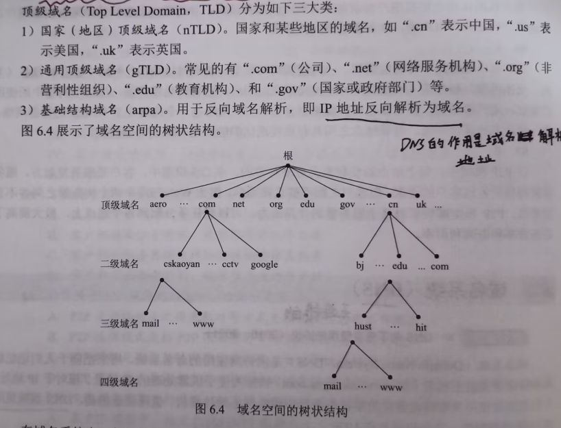
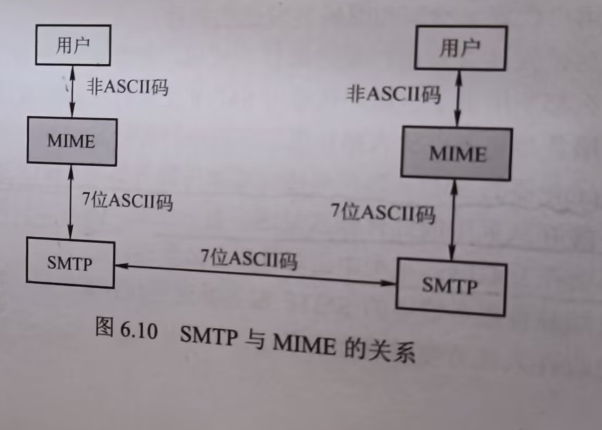

应用层，作为五层网络模型的最高层，主要内容其实也就是介绍几种在生活中比较常见的软件应用，学这部分内容主要还是起科普作用。

## 网络应用模型
这里主要介绍的就是两种：
- 客户/服务器模型(C/S模型)：大部分协议都是使用这个模型。
- P2P模型：P2P模型的重点是每一个结点既可以当客户机，也要当服务器。在获取服务的同时，也要位其他结点提供服务。而且P2P特别损硬盘。

## DNS(域名服务器)
在互联网上的通信，直接记录主机的IP地址是很不舒服的一件事情，但是记录他的网址就很方便了。

而DNS的作用就是将域名转换为对应的IP地址，采用C/S模型，协议运行在UDP上，使用53号端口。

一个域名服务器所负责管辖的区内<u>所有的结点能够连通的</u>,每个区设置响应的权限域名服务器，用来保存该区中所有主机的域名到IP地址的映射。

域名解析的方式有两种：

- 递归解析：如图所示，本地服务器如果没有相关映射就交给根服务器去找，这样一层一层寻找，最终把映射递归回来。但这样对根服务器要求太大，因为本地DNS找不到，都会先从根服务器开始找
- 迭代解析：这个更合理，根服务器如果没有响应的映射，就告诉本地DNS接下来去哪里找，依次迭代。
也响应的说明<u>一次查找最多使用4个查询报文和4个回答报文</u>

当然，实际生活中，本地的DNS服务器和本机都会有一个缓存空间，专门用来存储会经常访问的域名和其IP地址的映射。

## FTP(文件传输协议)

FTP采用C/S模型，使用TCP面向连接的可靠服务，一个FTP服务器进程可同时为多个客户进程提供服务

FTP在工作时是并行的使用两个TCP连接的，一个用来做控制连接(21号端口),一个做数据连接(20号端口)。

服务器监听21号端口，等待客户的连接，控制端口不用来传输文件。控制连接在整个会话期间一直保持打开状态

数据连接有两种传输模式：
- 主动模式PORT:客户连接到服务器的21号端口后，客户端随机开一个端口，并发送命令告诉服务器。服务器再通过20号端口和客户开放的端口想连接，并传输数据。
- 被动模式PASV：客户要读取数据时。发送PASV命令给服务器，服务器在本地随机开一个端口，客户再和这个端口相连。

主动模式就是服务器连接到客户的端口，被动就是客户连接服务器的端口.

## 电子邮件

- SMTP：用于用户发送到发送邮件服务器，TCP连接，使用25号端口
- POP3：用于用户接受邮件。TCP连接，使用110号端口
- IMAP协议，也是用于读取邮件的，特性是可以允许用户只获取报文的某一部分

由于SMTP协议只能传送7位的ASCII码，当邮件中有非ASCII的数据时，就需要把这些字符转换一下，引出了MIME的概念

## 万维网(WWW)
万维网以C/S模式工作，主要内容是三个部分：
- URL(统一资源定位符):为每一个在万维网上的文档提供一个独一无二的标识符

一般形式是:<协议>：//<主机>：<端口>/<路径>
- HTTP(超文本传输协议)：应用层的协议，使用TCP连接
- HTML：写过很多，不过多解释了。

HTTP既可以使用HTTP1.0(非持续连接)和HTTP1.1(持续性连接)

对于非持续连接，每加载一个网页元素就要重新进行一次TCP连接，加载完后就断开，导致加载每一个对象都要花费该对象的传输时间+2RTT

非持续性的就是建立连接后不断开了，传到不想传为止。