## 简单介绍数据链路层的功能

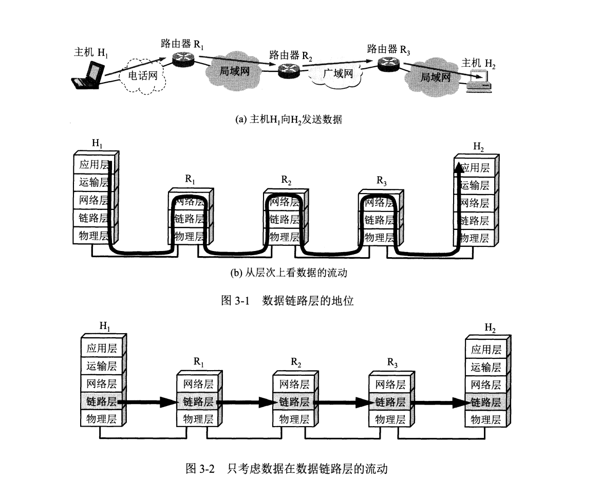
数据链路层的对等实体之间进行逻辑通信的数据单位是**帧**。数据链路层把网络层下交的数据封装成帧发送到链路上，并把接收到的帧中数据提取出来并上交给网络层。

数据链路最关键的三个作用：<u>封装成帧，透明传输，差错校验</u>

(1)封装成帧：指的是在一段数据的前后分别添加上首部和尾部，从而构成帧。首部和尾部有很多控制信息，其中一个重要作用就是**帧界定**。
在HDLC协议中，使用标志位F(01111110)来标志帧的开始和结束。
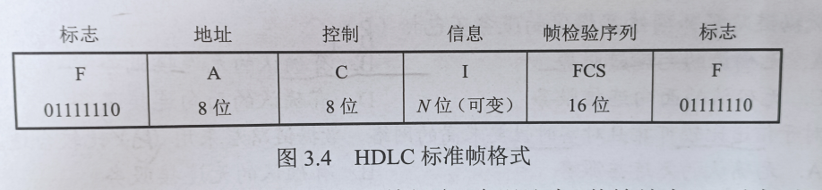

(2)透明传输:如果在数据中恰好出现和帧界定符相同的比特组合，为了解决提前“传输结束”的问题，采用透明传输来解决。<u>透明传输是指无论所传的数据是什么样的比特组合，都能按照原样无差错的在数据链路上传输。</u>

(3)流量控制：因为链路两端的结点可能工作速率有差异，为了防止接收方来不及接受的帧被后续不断发来的帧所淹没，采取某些反馈机制来限制发送方的发送速率。

在OSI体系中，数据链路层有流量控制的功能。而在TCP体系中，这个功能被移到了传输层。

(4)差错校验：因为信道噪声的印象，帧在传输过程中可能会出现位错和帧错：
- 位错：帧中某些位出现差错，采用循环冗余检验(CRC)来发现位错。
- 帧错：帧丢失，帧重复，帧失序等错误。

## 组帧
组帧主要还是解决帧定界的问题，有4种常见的方法：

- 字符计数法，在每一帧的开头使用一个计数字段用来表明该帧所包含的字节数。如果技术位出错，对于整个信息传输来说是灾难性的。
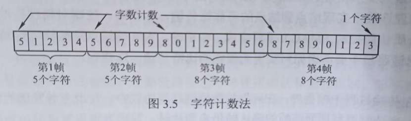
- 字节填充法：使用特定字节来界定一帧的开始和结束。比如'SOH'代表开始，'EOT'代表结束。为了防止数据中包含相同的字符，可以在数据中字符前面添加一个转移字符'ESC'来区分。

[科普：SOH（Start of Header）和 EOT（End of Transmission）这两个控制字符的使用来源于早期的电传打字机（Teletype）以及后来的通信协议，特别是ASCII（American Standard Code for Information Interchange）字符集。]

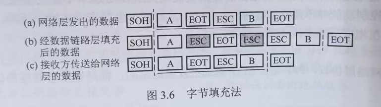
- 零比特填充法：常用于HDLC协议，和前面介绍的一样，采用特定比特串'01111110'来界定。为了避免数据中有相同字段，发送方在发送数据之前会实现扫描整个数据段，每遇到5个连续的1就自动填入一个0。接受方在接收后，进行逆操作就能还原本来的数据。
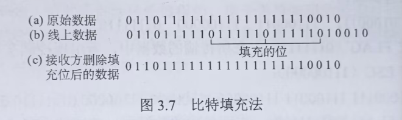
- 违规编码：采用非法编码来界定帧的开始和结束。如采用'00'表示0，'11'表示1；则'01'和'10'可作为非法编码作界定符。

## 差错控制

利用编码技术进行差错控制主要可以分成：
- 自动重传请求ARQ：接受方检测到数据发生差错后，就设法通知发送方重传数据，直到接收到正确数据为止。
- 前向纠错FEC：接受方不但能发现差错，同时具备确认具体错误的数据位，并将其纠错。

因此差错控制也根据事先的功能区分为：检错编码和纠错编码。

(1)检错编码：
- 奇偶检验码：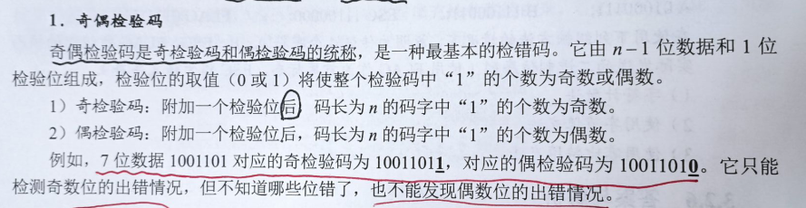
- 循环冗余码：
循环冗余码是非常常用的一项编码技术，其具体思想如下：
    - 设待传输数据M=101001，要添加的冗余码共有n位，即M左移n位，变成N=101001000(n=3)
    - 使用N和事先约定好的除数P进行模二除计算，获取余数R。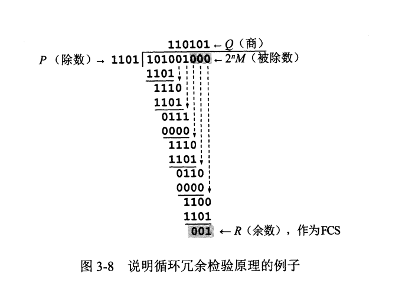
    - 发送方将M和R拼接起来，作为帧传送给接受方
    - 接收方在收获信息后，再将其和除数P进行模二除计算，若得数为0代表无误，否则代表数据错误。

由于发送方的FSC生成和接收方的CRC检验都是硬件自动完成的，所以处理速度很快。同时误码在接受CRC检验后，余数仍为0的概率极低，因此近似看作：<u>在数据链路层，只要被接收方接受的数据，就是正确的。</u>

(2)纠错码只讨论海明码，这一点存疑，我还没太搞清白

## 流量控制

流量控制指的是由接收方控制发送方的发送速率，从而让接收方有足够的缓冲空间来接受每一个帧，常见的流量控制手段由两个：
- 停止-等待流量控制：非常的简单，发送方在发送一个帧后，必须再接受到接收方传回来的应答信号，才能接着发送下一个帧。
- 滑动窗口：发送方有一个发送窗口，表示在未接受对方确认信息的情况下，发送方还能发送多少帧。
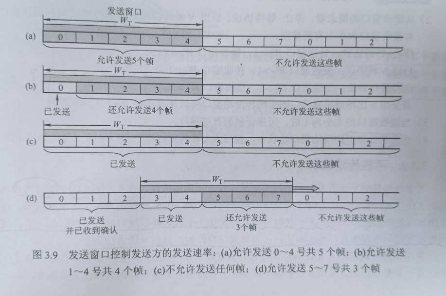
每当接受一个接受方返回的确认信号，发送窗口就可以往后移动一位。当窗口内全部是已经发送但还未收到确认的帧时，发送方就停止发送。

## 可靠传输机制(ARQ协议)
为了确保发送方发送的数据都能被接收方准确的接受，通常采取<u>确认</u> 和<u>超时重传</u>这两种机制实现。

确认是指接收方每接受到一个发送方送来的帧，就相应的发回一个确认帧。超时重传指的是发送方在发送一个帧后，就启动一个计时器，如果在规定时间内未收到接收方发回的确认信息，就重传该帧。

<u>注：重传是自动进行的，接收方不需要对发送方发出重传请求。</u>

(1)**单帧滑动窗口与停止-等待协议(S-W)**:类比的理解为发送窗口和接受窗口都为1的滑动窗口。

对于此协议，由于每发送一个数据帧就要停止等待，因此使用一个比特为数据编号就可以了，发出的帧交替使用0和1来标识，确认帧分为ACK0和ACK1。如果出现了连续的数据帧就代表发送方进行了超时重传，出现了连续的确认帧就代表接收方收到了重复帧。

同时由于需要超时重传和判定重复帧，发送方和接受方都应该设置一个缓存区用来缓存数据。

(2)**多帧滑动窗口与后退N帧协议**(GBN):
若采用n比特编号，则发送窗口的大小应该1<x<=2^n+1,若太大，会导致接收方无法分辨新旧数据帧。
发送方可以在未收到接收方的确认帧之前，连续的把发送窗口里面的帧全部发送出去。但是由于接收方的接收窗口只有一个帧的大小，因此如果发送窗口内的某一个帧在超时之后仍没有收到确认，则发送方必须重传该帧和此帧之后的全部帧。<u>接收方只允许按顺序接受帧。</u>
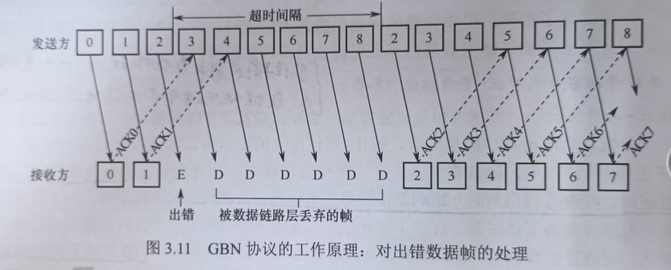
为了减低开销，GBN协议需要接收方可在连续收到多个正确的数据帧之后，只对最后一个帧返回确认信息，即对某个数据帧的确认代表该帧和所有之前的帧都被正确无误的收到了。

(3)多帧滑动窗口和选择重传协议(SR):为了提高信道利用率，可以设法只重传出现差错和计时器超时的帧，因此需要扩大接受窗口，以接受那些失序但正确到达且序号落在接收窗口内的数据帧。
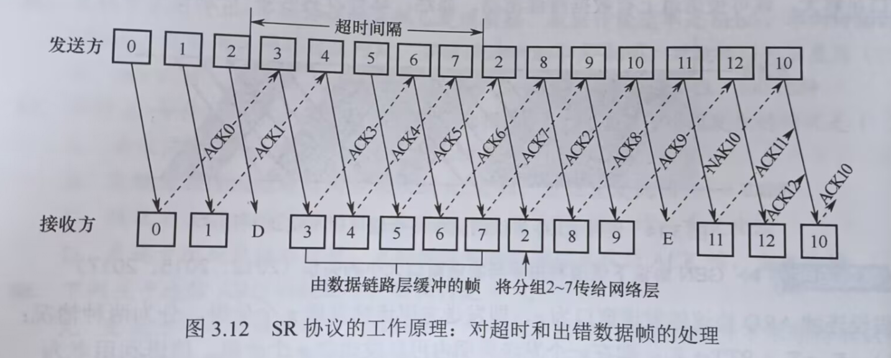
SR协议还规定，一旦接收方检测到某个数据帧出错，就会向发送方发送一个否定帧NAK，要求发送方立即重传NAK指定的数据帧。

同时，SR协议要求：接受窗口大小<=发送窗口大小；发送窗口大小+接受窗口大小<=2^n

因为如果在接收窗口后移之，之前的确认帧丢失就会触发发送方的超时重传，此时接收窗口i的新序号和之前的旧序号会发生重叠。而接收窗口如果大于发送窗口，那么接收窗口永远不会被占满，则会造成接受窗口的浪费。

***
讨论信道利用率，指的是发送方在一个发送周期(从开始发送分组到收到确认的时间)内,有效发送数据的时间和整个发送周期的比值。

(1)停止-等待协议信道利用率:
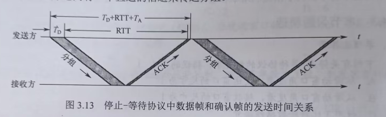
$$
U = \frac{T_D}{T_D + RTT + T_A}
$$
TD和TA都是发送时延，RTT是往返时延

(2)连续ARQ协议的信道利用率：
此协议采取流水线传输的特质，发送方可以连续发送多个分组，具体利用率可分如下两种情况：
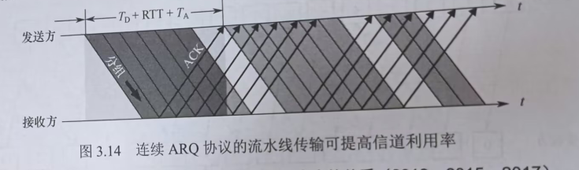
假设发送窗口是n，则发送方可以连续发送n个分组：
- nTd<Td+RTT+Ta, 则说明一个发送周期内可以发送发送窗口内的全部数据。此时信道利用率为：
$$
U = \frac{nT_D}{T_D + RTT + T_A}
$$
- nTd>Td+RTT+Ta，则说明一个发送周期内发不完窗口内的全部数据，此时整个周期内都在满着发数据，信道利用率为1.
