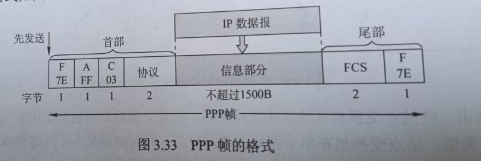

## 介质访问控制
在同一信道上可能有多个结点，为了确保多个结点之间传递信息不会相互干扰，就需要介质访问控制协议，实现这个功能的层叫介质访问控制层(MAC)是数据链路层的一个子层。

常见的介质访问控制方法有：<u>信道划分介质访问控制，随机访问介质访问控制，轮询访问介质访问控制。</u>

(1)信道划分介质访问控制：时分复用，频分复用，波分复用(在一根光纤中可以同时传递多种不同波长的光信号，而不互相影响)，码分复用(太复杂了，先跳了)。

(2)随机访问介质访问控制(争用型协议):
随机访问协议中，用户可以随意决定信息发送时间。在总线型网络中，就会出现两者冲突的情况。因此为了解决这项冲突，就要引入协议来规范了。
- ALOHA协议：分为纯ALOHA和时隙ALOHA，差异并不大。
    - 纯ALOHA协议的思想是:网络中的任何站点可以随时发送信息，但在一定时间没有收到确认的话，便判断为发生了冲突，此时该站点应等待一段时间，再尝试重发数据。
    
    - 时隙ALOHA协议：同步各站点的时间，将时间划分为一段段等长的时隙，规定站点只能在每个时隙开始时才能发送帧，而发送帧的时间必须小于或等于时隙的长度。
    
    如图所示，每个帧在到达之后，一般都要在缓存中等待一段小于时隙的时间才能发送出去。
- CSMA协议：如果每个站点在发送前先监听以下公用信道，发现信道空闲后再发送，则会大大降低冲突的可能性。这就是载波监听多路访问协议(CSMA)的核心思想。
    - 1-坚持CSMA：站点在发送数据时，首先监听信道。若信道空闲，则立刻发送数据，否则就持续监听信道，直至空闲为止。
    - 非坚持CSMA:为了防止多个站点在同时监听等待后，一起发送数据再导致冲突的情况发送。这个协议在监听到信道空闲后再等一个随机时间才发送数据。
    - p-坚持CSMA: 只适用于时分信道，前面都差不多，在信道空闲时有p概率直接发送数据，有1-p概率推迟到下一个时隙再继续监听，也是为了解决非坚持CSMA面临的问题。
- CSMA/CD协议：适用于<u>总线型和半双工网络环境</u>。可以简单概括为："先听后发，边听边发，冲突停发，随机重发。"

由于电磁波在信道上的传播速率有限，因此当某一时刻发送站检测到信道空闲时，信道其实不一定空闲。CSMA/CD的站不能同时进行发送和接受，因此采用该协议的以太网只能进行<u>半双工</u>通信

最短帧长和争用期
某一站发送了一个短帧，但在发送前未检测除冲突，检定这个帧在到目的站的途中和其他帧发生冲突，因此目的站将其丢弃。但发送站并不知道发生了冲突，也就不会重传该帧。为了避免这种情况。以太网规定了<u>最小帧长</u>,在最短帧长之内检测到冲突就停止发送，超过最短帧长就判断为抢占信道成功。其计算公式为：
$$最短帧长=总线传播时延*数据传输速率*2$$

发生冲突的两个站点紧接着继续发送也没有什么意义，使用二进制指数退避算法
- CSMA/CA协议：这个主要作用于无线局域网，将本来要面临的冲突检测改为冲突避免。

冲突避免指的是要尽可能的降低冲突的发生，因为802.11无线局域网不适用冲突检测，一旦站点开始发送一根帧，那么一定会坚持发完它。
- 轮询访问：令牌传递协议：适用于容易发生冲突的网络，所有主机都要令牌才能发送数据，令牌(Token)在所有站点之间轮询，拥有令牌才能传数据。传完数据后释放令牌，其他站点才能再获取令牌。

## 局域网(LAN)
局域网主要还是看三个因素:<u>拓扑结构，传输介质，介质访问控制方式。</u>

## 以太网和IEEE 802.3
以太网是目前最流行的<u>有线</u>局域网技术，逻辑上常采用<u>总线拓扑结构</u>，所有计算机共享同一个总线，信息以广播的形式发出，采用CSMA/CD方式对总线进行访问控制。

以太网为了简化通信，采取了两种手段：

(1)采用无连接的工作方式，既不对要发送的数据进行编号，又不要求接收方发送确认；以太坊尽最大努力交付数据，提供的是不可靠服务。

(2)发送的数据都是使用曼彻斯特编码的信号，每个码元之间出现一次电压转换，接收方通过接受这种转换来提取位同步信号。

### 网络适配器
计算机需要通过网络适配器才能与局域网连接，适配器中装有处理器和存储器，工作在数据链路层。适配器和局域网的通信采用<u>串行</u>的方式，而适配器与计算机的通信采用<u>并行</u>的方式。由此可知，适配器的主要功能就是数据的<u></u>串并行转换。

IEEE 802标准为每一块网络适配器都规定了一个48位的全球地址，适配器从网络上每收到一个帧，首先采用硬件检查MAC帧中的目的地址，如果是发送给自己的就收下，否则就丢弃它。

由于以太网是广播的形式，发送给自己的帧可以有以下三种：
- 单播帧(一对一)：目的地址就是自己的MAC地址
- 广播帧(一对全体)：发送给局域网内全部的站点(全1地址)
- 多播帧(一对多)：发送给本局域网上一部分站点的帧。

- MAC层里面的‘类型’字段指出数据字段应该上交给哪个上层协议处理，如IP层的网络协议。
- FCS采用CRC校验，除了检查数据部分，还要检查目的地址，源地址和类型。
- 在物理层中，前面插入的8个字节中，前7个字节是前同步码，用来实现MAC帧的比特同步。后1个字节是帧开始界定符，表明后面的信息是MAC帧。

以太网一次最多只能传1500字节，如果IP数据包超了就要切片处理。同时最小字段是64个字节，如果IP数据包少于46字节(从CSMA/CD中得知最小帧长为64B，再减去帧的首部+尾部18B)，还要做对应的填充。

## 广域网(WAN)
首先要明确，广域网不是互联网

广域网主要使用的是PPP协议,是作用于<u>点对点链路控制协议</u>。

PPP帧如上所示，首部和尾部各有一个标志字段F，用来做帧界定符。当PPP使用异步传输时，采用字节填充法，添加转义字符；当PPP使用同步传输时，采用零比特填充发，添加'0'

由于PPP协议是点对点的，因此无须使用CSMA/CD协议，没有最短帧长的限制，所以信息段的长度可以是：0-1500字节之间。

注：
- PPP不使用序号和确认机制，只保证无差错接收，因此是不可靠服务。
- PPP仅支持全双工的点对点链路，不支持多点链路。
- PPP的两端可以运行不同的网络协议，但仍可以使用同一个PPP进行通信。
- PPP是面向字节的，所有PPP帧的长度都是整数个字节。

## 数据链路层设备