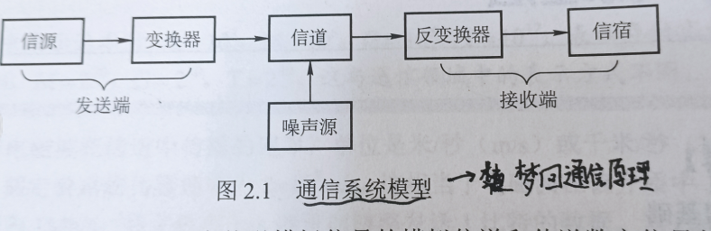
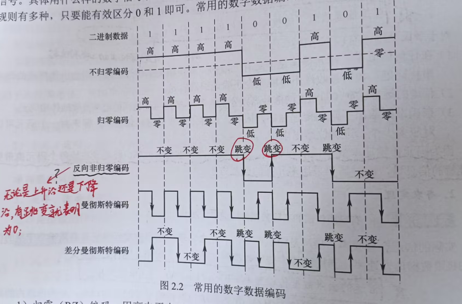
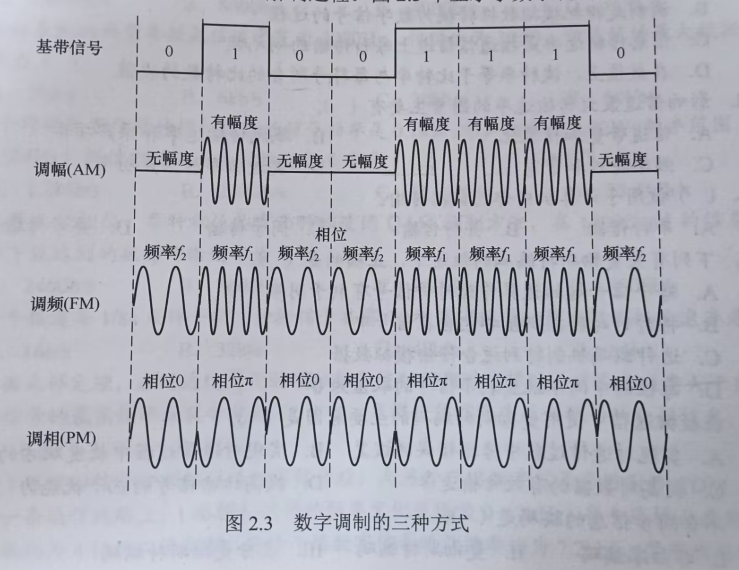

## 通信基础知识

(1)数据、信号、码元

通信的目的是为了传递信息，如文字，图片，视频等。<u>数据是传送信息的实体，信号是数据的电气表示</u>。

在通信系统中，常用一个固定时长的信号波形表示一位K进制数字，代表不同离散数值的基本波形被称之为码元，而该固定时长被称为码元宽度。<u>一个码元可以代表若干比特的信息量。</u> 如二进制中，一个码元代表一个比特，八进制中，一个码元代表三个比特的信息。

(2)信源、信道、信宿

信源是发送和产生数据的源头，信宿是接受数据的终点，信道是信息传输的介质。

从通信双方信息的交互方式来看，可分成：
- 单向通信：只有一个方向的通信，如无线广播，电视广播。
- 半双工通信：通信双方都可以发送和接受信息，但是任何一方都不能同时接收和发送信息。
- 全双工通信：通信双方可以同时发送和接受信息。

单向通信只需一个信道，而半双工和全双工都需要两个信道

(3)速率、波特、带宽

速率常有两种描述形式：
- 码元传输速率(也称波特率)，表示单位时间内数字通信系统所传输的码元数，单位是波特(Baud)。1B代表每秒传输1个码元。
- 信息传输速率(也成为比特率),表示单位时间内，数字通信系统传输的比特数，单位是比特/秒(b/s)。

<u>如果一个码元是N进制的，那么波特率M(B)，那么比特率就是M*N(b/s)</u>

***
## 信道的极限容量

(1)奈奎斯特定理：在任何信道中，码元的传输速率都是有上限的，为了避免码间串扰对接收端的影响，在理想低通(没有噪声，带宽有限)的信道中:
$$
极限数据传输速率 = 2W \log_2 V(单位b/s)
$$

**注**：
- W代表的是信道的频率带宽，单位是HZ。
- V代表有多少种不同的码元，也就变相的直到了一个码元可以表示多少个比特的信息。

(2)香农定理：在带宽受限且有高斯噪声干扰的信道极限传输速率
$$
信道极限传输速率 = W \log_2 \left( 1 + \frac{S}{N} \right)(单位b/s)
$$
**注**：
- W代表的是信道的频率带宽，单位是HZ。
- S代表的是信道内所传输信号的平均功率。
- N代表信道内的高斯噪声功率。
- $$\text{信噪比 (单位 dB)} = 10 \log_{10} \left( \frac{S}{N} \right)$$

<u>之所以采取上述的形式来表示信噪比，原因是实际情况下S/N的比值可能非常大，因此了方便表示，采用分贝dB来表示。</u>

*** 
## 常见编码方式
信号是数据的具体表示方式，数据无论是数字的还是模拟的，为了传输目的，都要转换成信号。将数据转换为模拟信号的过程叫调制，将数据转换为数字信号的过程叫编码。

(1)

这些编码方式之前都学过，值得注意的就是：
- 反向非归零码：用电平的跳变表示0，电平保持不变表示1
- 差分曼彻斯特编码：每个码元的中间都发生电平跳变，但电平跳变指标是时钟信号，而不表示数据。数据的表示在于每一个码元开始处是否有电平跳变，无跳变表示1，有跳变表示0

(2)
- 调幅(AM)或幅移键控(ASK)：通过改变载波的幅度来表示数字1和0。
- 调频(FM)或频移键控(FSK): 通过改变载波的频率来表示数字1和0。
- 调相(PM)或相移键控(PSK)：通过改变载波的相位来表示数字1和0。
- 正交幅度调制(QAM):在频率相同的前提下，将AM和PM结合起来，设波特率为B，采用m个相位，每个相位有n种振幅，则该QAM的数据传输速率R为
$$R=B \log_2 (mn)(单位为b/s)$$

***
## 科普：中继器和集线器

(1)信号在经过一长段电缆后会产生失真和衰落的情况，为了保证最终能传递到接收端，可以在传输链路中增设中继器。<u>顾名思义，中继器的功能在于整型，放大并转发信号。</u>

注：如果一个设备具有存储转发功能，则可以认为这个设备能连接两个不同的协议，而中继器是<u>没有存储转发功能</u>的。

(2)集线器实际上就是一个多端口的中继器，在一个端口接收到输入信号后，集线器将整形后的信号转发到除输入端口外的全部端口。<u>如果同时有两个或多个输入，则输出将发生冲突，导致这些数据无效</u>

物理层所需要考虑的是如何在连接计算机之间的物理介质上传输比特流，其主要任务是确定一些物理上面的特性:
- 机械特性：指明接口所用的形状和尺寸，引脚数目和排列。
- 电气特性：指明在线上的电压范围，传输速率和距离限制。
- 功能特性：在某条线上出现的某一电平的电压意义和每条线的功能。
- 过程特性：说明对不同功能的可能事件的出现顺序。
