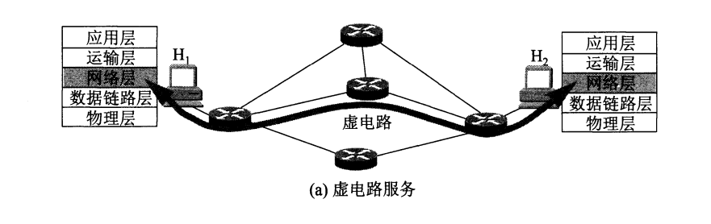
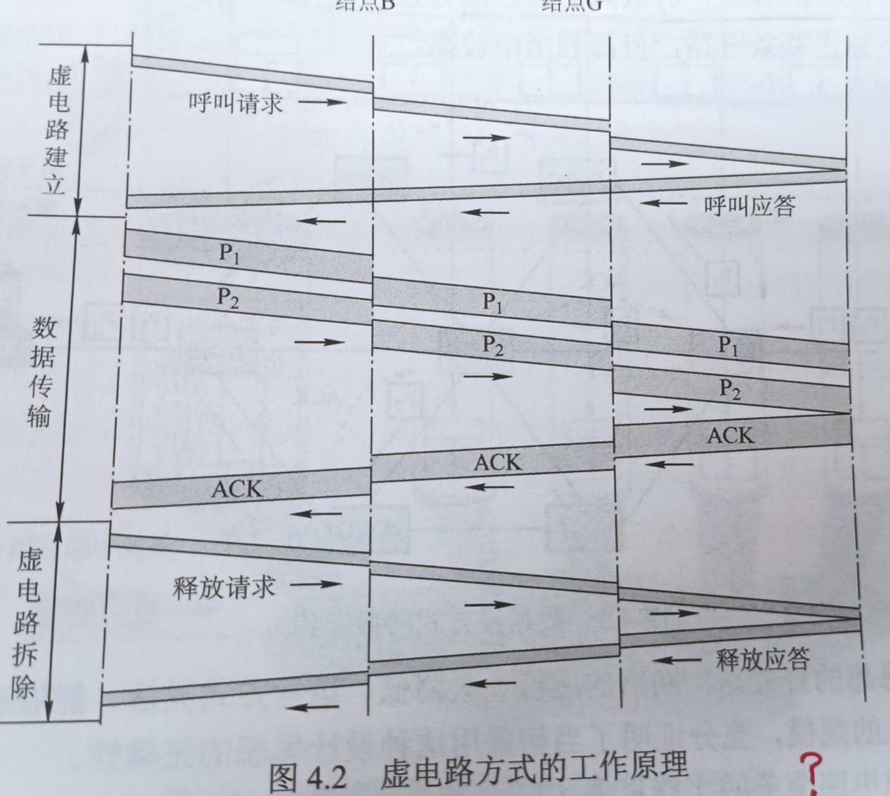
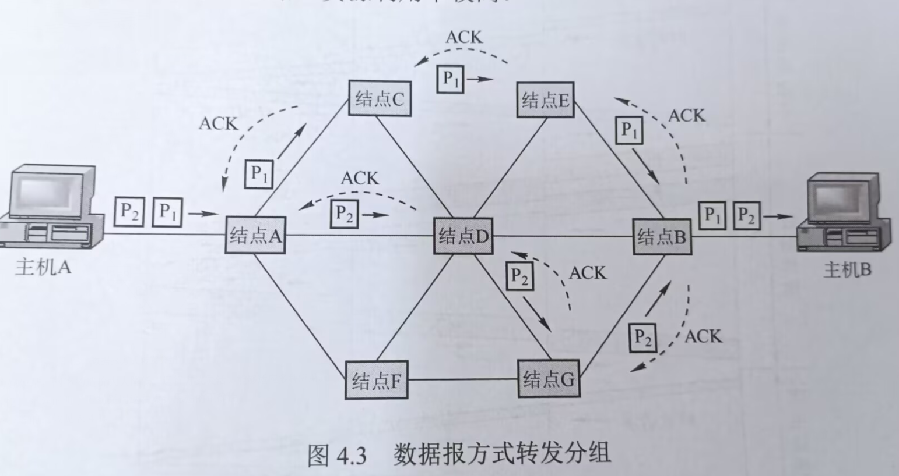
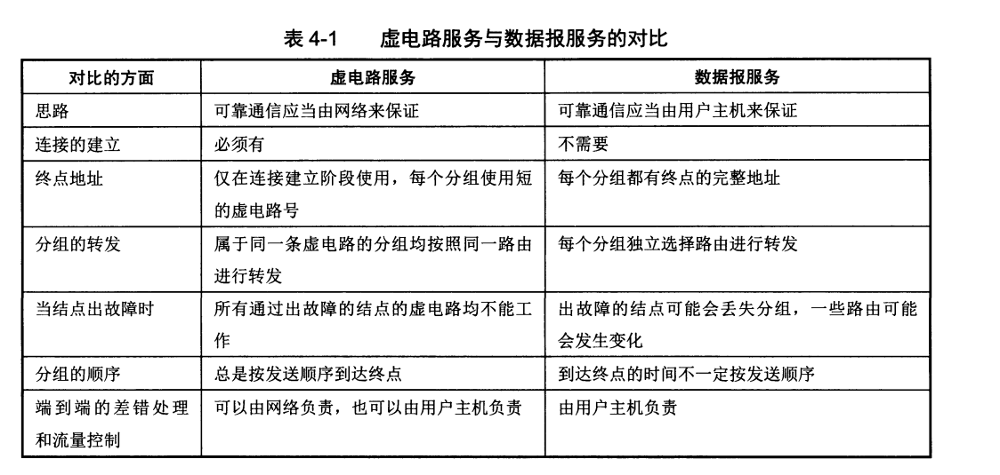
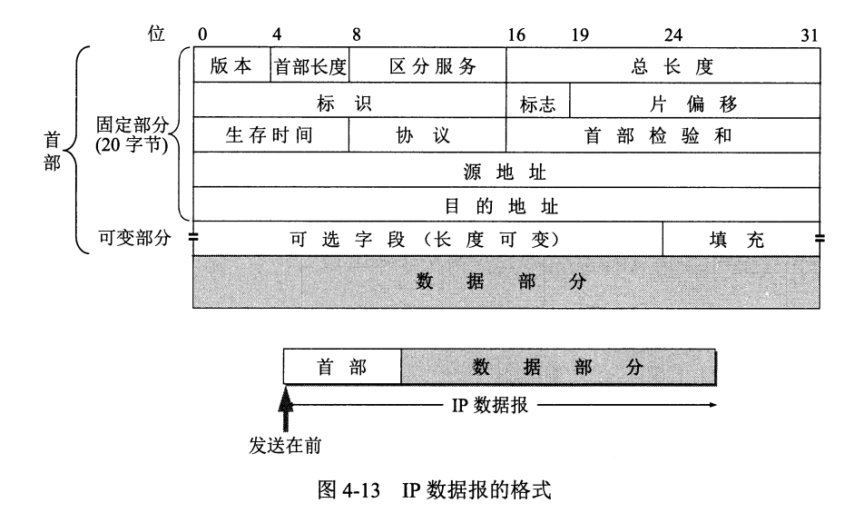
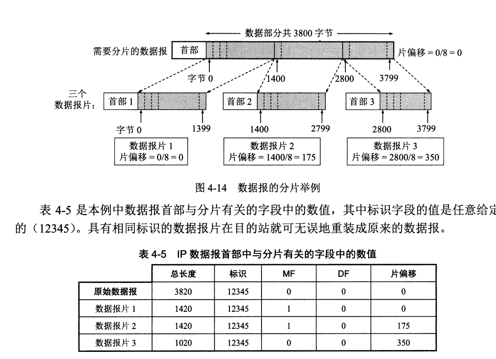
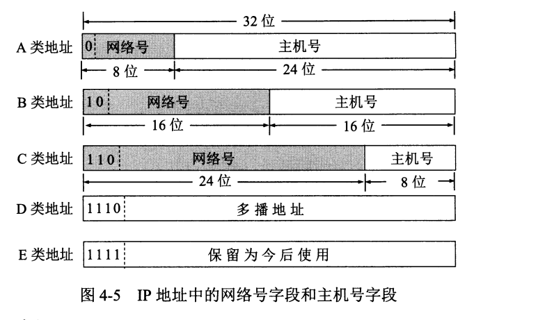
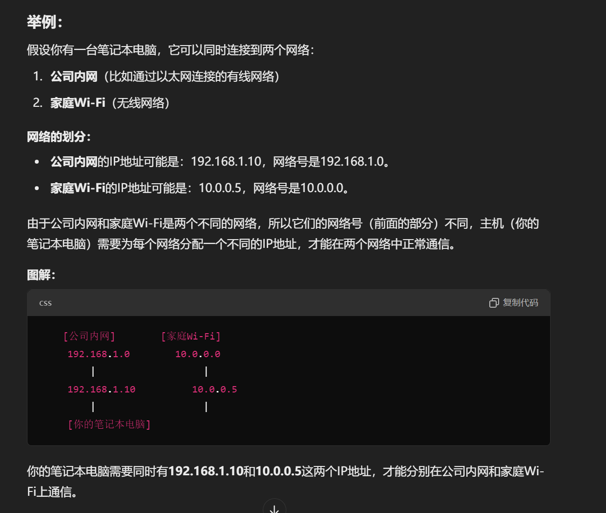
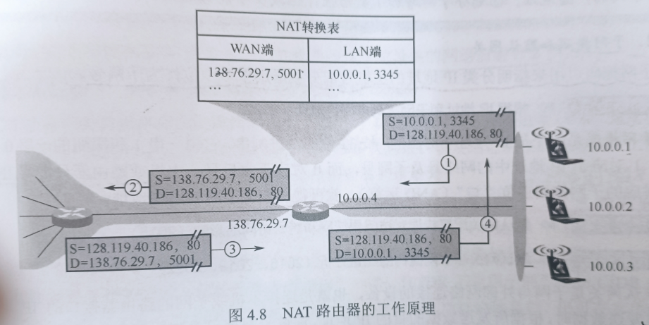

## 网络层的功能
网络层提供主机到主机的通信服务，主要的任务就是把分组从源主机经过多个网络和多段链路传输到目的主机。该任务可以被划分为<u>分组转发</u>和<u>路由选择</u>这两种功能。

在TCP/IP体系结构中，网络层对上只提供无连接的、尽最大努力交付的数据报服务。其传输的分组可能会<u>出错、丢失、重复、失序或超时</u>。

***
互联网是由全球不同的异构网(拥有不同的拓扑结构，使用不同的协议，不同的物理介质等)组成的，为了能让异构网相互可以连接，就需要使用一些中继系统来完成：
- 物理层中继系统：转发器、集线器
- 数据链路层中继系统：网桥或交换机
- 网络层中继系统：路由器
- 网络层以上的中继系统：网关

网络层提供的两种服务：

(1)面向连接的虚电路服务：

在两台计算机进行通信之前，要先建立一条逻辑上的虚电路(这台电路并不是专用的)。连接一但完成，也就固定了虚电路对应的物理路径。

每次建立虚电路时，就将一个未使用过的虚电路号分配给该虚电路，用来和其他已经建立好的连接的相互区别。<u>分组的首部仅仅在连接建立时使用完整的目的地址，之后首部都是放虚电路号就可以了。</u>

虚电路的致命缺陷就是，电路中任何一个结点或者链路遭到破坏，就会导致整个电路瘫痪，就像电话线一样

(2)数据报：网络在发送分组之前不需要事先建立连接，源主机的高层协议将报文拆分为若干数据段，再加上地址等控制信息后构成分组。中间节点存储分组一段时间，找到最佳路由后，就马上转发分组。

网络具有冗余路径，当某个交换结点或一条链路出现故障时，可相应地更新转发表，寻找另一条路径转发路由。

***
*拥塞控制*：

一个网络中出现了过量的分组，导致网络拥挤，吞吐量下降的情况就被认定为拥塞了，解决方法有两种：

(1)开环控制：设计网络之初就考虑到可能导致拥塞的因素，并制定好解决方案。在决定决定时不考虑当前网络的状态。

(2)闭环控制：采用监控网络系统去监视，实时了解哪里出去拥塞并对应的去解决。

***
*SDN基本概念*：网络层转发分组还可以设置一个逻辑上的远程控制器(可由多个服务器组成),远程控制器掌握各个主机和整个网络的情况，可以为每一个分组计算出最佳路由。

## IPV4

一个IPV4分组或者说IP数据报由<u>首部</u>和<u>数据部分</u>,首部的长度一般固定为20B。

对字段解释：
- 首部长度共有4位，单位为4B,最大可表示的首部长度就是60B(15*4B)
- 标识占16位，这是一个计数器，每产生一个数据报就+1，并复制给标识字段。但标识并不是序号，因为IP是无连接服务。当IP数据报的长度超过网络的MTU(最大传送单元)的时候，就要对其进行切片处理，为了之后方便在接受端把切片复原，就要对同一个数据报切出来的分组都附上相同的标识。
- TLL(生存时间)占8位，用来表示最多可以跳转多少个路由器，每跳转一个路由器就-1，归零代表该分组必须被丢弃
- 片位移占13位，用来指出分片后的某片在原数据报中的相对位置。片偏移以8B为偏移单位。
- 标志(Flag)占3位，标志字段最低为MF,MF=1表明后面还有分片，MF=0表明最后一个分片。标志字段中间的一位是DF，只有当DF=0时才允许分片。

***
### IPv4地址与NAT
IPv4地址时给互联网上的每一台主机或路由器的每一个接口分配的一个在全球范围内唯一的32位标识符。

无论哪类IP地址都是网络号和主机号两部分组成的。网络号指明主机所连接到的网络，一个网络号在整个互联网的范围内是唯一的。而主机号在对应网络下也是唯一的，因此，一个IP地址在整个互联网范围内是唯一的

特殊IP地址：
- 主机号全为0表示本网络本身：202.98.174.0
- 主机号全为1表示本网络的广播地址，使用这个地址会把分组广播到全网络：202.98.174.255
- 127.0.0.1这样的就是环回自检地址，也就是常用的localhost,用来给主机的内部设备通信用。
- 32位全为0，即0.0.0.0表明本网络的全部主机
- 32为全为1，即255.255.255.255表示整个TCP/IP网络的广播地址，实际使用中由于路由器对广播域的隔离，等效为本网络的广播地址。

IP地址是标志一台主机和一条链路的接口，当一台主机同时连接二个网络时，该主机就必须同时拥有两个响应的IP地址，其网络号必须是不同的。 

### 网络地址转换(NAT)
IP地址又区分为公共IP地址和私有IP地址，简单的区别就是共有地址可以直接连接到因特网，而私有地址只能在本网络中传递流量。

在互联网中的所有路由器，对目的地址是私有地址的数据包一律不进行转发。

如上图所示，假设家庭中的一个设备想要往128.119.40.486:80服务器发送信息，首先通过网关，网关的NAT功能会把私有地址(10.0.01：3345)转换为公共IP(128.119.40.186：80),并且更新自己的NAT转换表，从而实现了一个网络中所有设备只需要一个公共IP地址就可以上网的需求。同时，外面也不可能知道本网络的详细拓扑。
***
### 划分子网和路由聚合
{网络号：主机号}的两层IP地址不够灵活，现在使用的都是三层IP地址即{网络号：子网号：主机号}。

划分子网是一个单位内部的事情，单位对外仍然表现为没有划分子网的一个网络。划分子网的办法是：<u>从原来的主机号里面分出若干位作为子网号</u>。子网中主机号全为0和1的地址不能被指派。
***
当路由器接收到一串IP地址时，是看不出哪些位是子网位的，因此还需要子网掩码来辅助。

子网掩码是一串32位的只有1和0组成的二进制串，通过和对应的IP地址进行“与”操作，就可以得出对应子网的网络地址。

默认网关是子网和外部网络连接的设备，当主机发送信息时，先根据目标IP地址，通过子网掩码判断目的主机是否在子网中。如果不在，就发送到默认网关，由网关转发到其他网络。

无分类编制CIDR消除了传统A,B,C类地址和划分子网的概念，使用斜线记法来表明IP地址中哪些是网络号，哪些是主机号。

如：128.14.32.5/20
表明前20位是网络号，后12位是主机号，由于取消了子网的概念，把拥有相同网络前缀的IP地址看作一个块。CIDR地址块中的地址数一定是2的整数次幂，实际可以指派的地址数通常为$$2^N-2$$

### 地址解析协议(ARP)
IP地址是网络层及之上层所用的地址，MAC地址是数据链路层使用的地址。IP地址被封装到IP数据报后，再被封装成MAC帧，下方的数据链路层也就看不到了。同理，当MAC的首部被拆除后，送到网络层来时也看不到MAC地址了。

在实际寻址时，各个路由器依据其路由表选择到目标网络所需的下一跳地址(路由器的物理端口号或下一网络地址)，在IP数据包不断的被传递时，MAC帧的首部的源地址和目的地址也在不断改变。而IP数据包通过多次路由转发到达目标地址后，改为在目标局域网中通过数据链路层的MAC地址以广播的方式寻址。

无论网络层使用什么协议，在实际网络的链路上传送数据帧时，最终必须用到MAC地址，因此就需要有一个协议，来完成IP地址到MAC地址的映射，这就是地址解析协议*ARP*(Address-Resolution-Protocol)