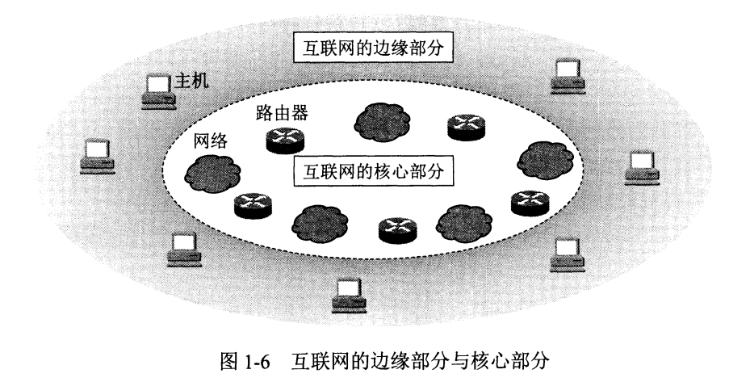
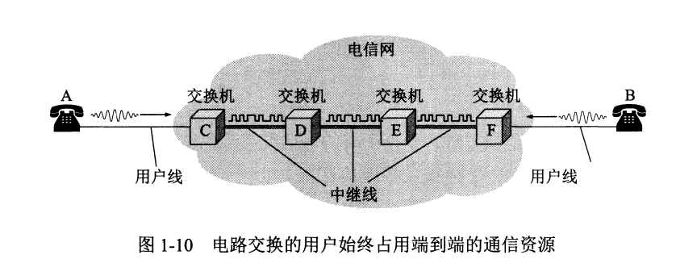
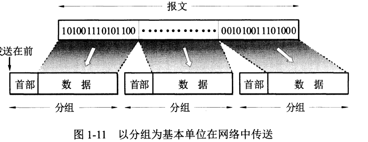
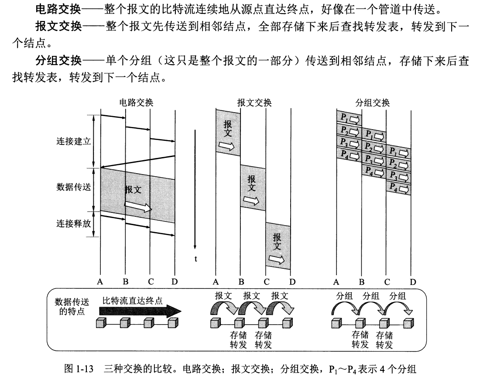
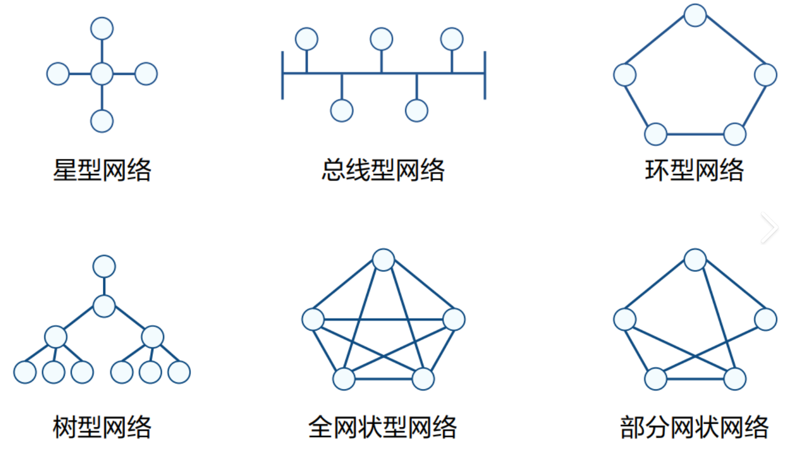
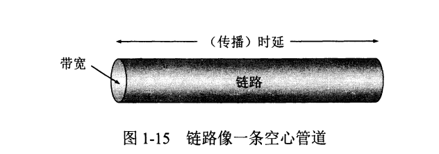

# 计算机网络体系结构

从组成部分上来说，计算机网络主要由硬件，软件和协议组成，可以对应类比于：交通设施，汽车，交规。

- **硬件**主要由主机，通信链路(双绞线，光纤),交换设备(路由器，交换机)，通信处理器(网卡)等组成。
- **软件**就是常用的比如说Email，QQ等用来事先资源交换的软件。
- **协议**是计算机网络的核心，定义了网络传输中所必须遵守的规范。

从工作方式上来说，计算机网络又可以区分为核心部分和边缘部分。

(1)边缘部分：由所有连接在互联网上的主机组成，**这部分供用户直接使用**，用来通信和资源交换。

(2)核心部分：由大量网络和连接这些网络的路由器组成，**其为边缘部分提供服务**。

需要特意注意的事情：常说的"主机A与B之间的通信",其实质上所指的是"运行在主机A上的某个程序与运行在主机B上的某个程序之间进行通信";
***

### 电路交换，报文交换和分组交换

在计算机网络核心部分中，路由器起着重要的作用，其功能是对收到的分组进行存储转发。

(1)电路交换

最常见的电路交换网就是传统电话网，在双方建立通信之前要先<u>建立一条专门的物理通信链路</u>，该链路由通信双方独占，直到通信结束后才被释放。

(2)报文交换

报文交换的数据单位是报文，包括用户数据，目标地址，源地址等信息，采用的是<u>存储转发</u>技术，整个报文首先被传送到相邻结点，<u>全部存储后</u>再查询转发表，再传送到下一个结点，反复直到传送到目标地址。

(3)分组交换

报文交换中，报文如果过长，则会对交换结点的缓存容量有很大的需求，并且每一个报文的长度也是未知的。为了解决这一问题，可以将报文中的数据按一定大小拆分为若干份数据组，再对每一个数据组加上首部，就构成了分组。

分组交换也有它的问题：
- 由于每一个分组都增加了首部，因此增大了要传输的信息量。
- 可能在传输过程中出现失序，丢失或重复分组的情况，分组到达目的地后还需要对分组按编号进行排序。

从提升整个网络的信道利用率来看，报文交换和分组交换优于电路交换，其中分组交换比报文交换的时延小，<u>尤其适合计算机之间的突发式传输</u>

计算机网络按拓扑结构分成总线型，星型，环形，网状

***

### 计算机网络的性能指标
(1)速率：指的是结点在信道上传输数据的速率，有b/s,bit/s,Mb/s等。

在计算机网络中，为了方便计算，单位之间的换算变成了1000而不是1024

(2)带宽：表示通信链路所能传输数据的能力，实质就是<u>最高数据传输速率</u>，单位是比特/秒(b/s)。

(3)吞吐量：指的是单位时间内通过某个网络(信道，接口)的实际数据量。

(4)**时延**：数据(一个报文或分组)从网络的一端传送到另一端所需的总时间，由<u>发送时延，传播时延，处理时延和排队时延</u>构成。

- **发送时延**，也称传播时延。结点将分组的所有比特推向链路所需的时间，即从发送分组的第一个比特算起，到该分组的最后一个比特发送完毕所需的时间。
$$发送时延=\frac{\text{分组长度}}{\text{总发送速率}}$$
- **传播时延**：一个比特从链路的一端传输到另一端所需的时间。
$$传播时延=\frac{\text{信道长度}}{\text{电磁波在信道上的传播速率}}$$
- **处理时延**：数据在<u>交换结点</u>为存储转发而进行的一些必要处理所花的时间，如分析分组的首部，从分组中提取数据，差错检验和查找合适的路由。
- **排队时延**：分组在等待转发时花费的时间。

$$总时延=发送时延+传播时延+处理时延+排队时延:$$
除非特殊标注，否则处理时延和排队时延可以忽略不计

(5)时延带宽积：当发送端的第一个比特即将到达终点时，发送端已经发送出了多少比特。
$$时延带宽积=传播时延*带宽$$

(6)往返时延：发送端发出一个短分组，到发送端收到来自接收端的确认总共经历的时延。

(7)信道利用率:就是计算一个信道有百分之几的时间是有数据通过的。