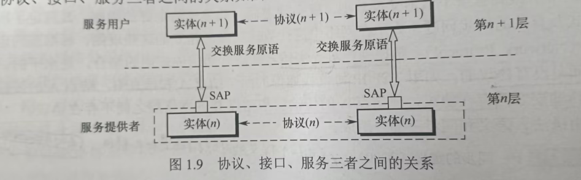
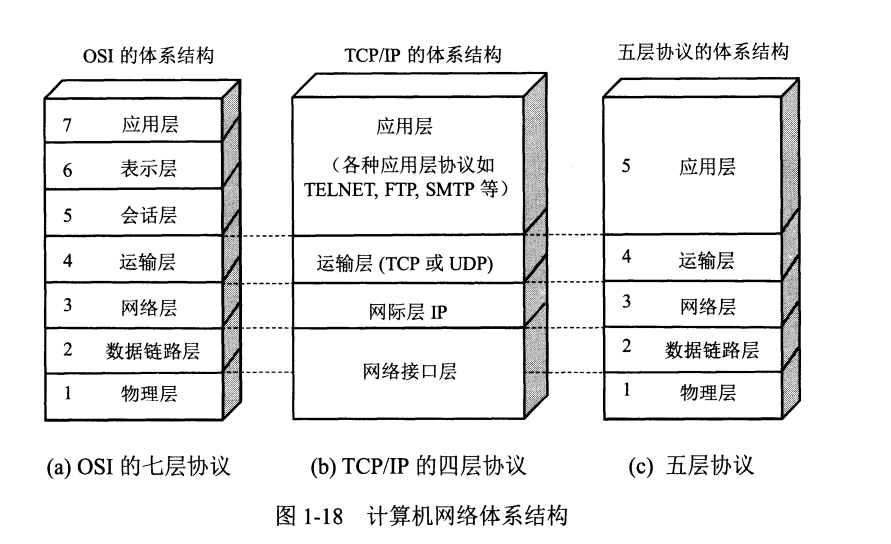

## 计算机网络协议，接口，服务的概念

在计算机网络分层结构中，第n层的活动元素被称之为第n层的实体，<u>实体指的是任何可以发送或接受信息的硬件或软件</u>。不同主机的同一层被称之为<u>对等层</u>;同一层的实体被称之为<u>对等实体</u>。

(1)**协议**： 控制对等实体之间通信的规则，不对等实体之间不存在协议。协议由<u>语法、语义、同步</u>三部分组成。

- 语法：规定通信之间传输的信息和对应的控制信息应该是什么样的格式。 
- 语义：规定主机需要在什么时候发出何种控制信息、完成何种动作、做出何种应答。
- 同步(时序)：规定执行各种操作的条件、时序关系等，即对于事件的事先顺序进行详细说明。

(2)**接口**：同一结点内相邻两层的实体交换信息的逻辑接口(SAP)。每层只能在紧邻的两层之间定义接口，而不能跨层定义。

(3)**服务**：指的是下层为紧邻的上层提供的功能调用，是垂直的。上层只能看到下层为其提供的服务，而看不到下层的协议。也是说并非在一层内完成的所有功能都是服务，<u>只有那些能被上层所看到的功能才能叫服务。</u>

***

## ISO/OSI参考模型和TCP/IP模型
OSI的模型过于复杂而不适用，TCP模型过于精简，所以在研究计网的时候采取五层协议，但实际生活中构建的仍然是TCP/IP协议。

## OSI参考模型的层次结构
(1)物理层：传输的单位是比特，功能是在物理介质上透明的传输原始比特流。

具体来说物理层负责定义
- 通信链路和结点连接所需接口的参数(机械形状和尺寸、交换电路的数量和排列)。
- 还有规定了通信链路上所传输的信号的意义和电器特征(如接受到什么识别为0，接收到什么识别为1)。

<u>注意：传输信息所需要的物理介质(双绞线、光纤、无线信道)不在物理层协议内，而是物理层协议下面。</u>

(2)数据链路层：数据链路层的传输单位是帧，主要作用是将物理层提供的可能出错的物理连接改造成逻辑上无差错的数据链路，使其对网络层表现为一条无差错的链路。